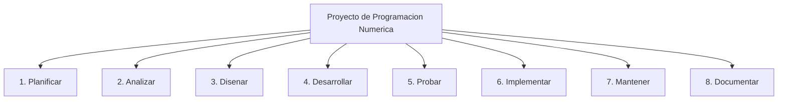
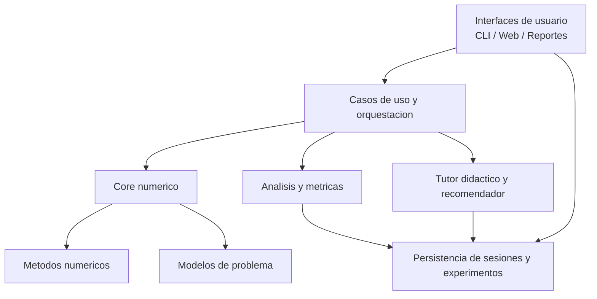

# Programación Numerica

Aplicacion de consola en Python para practicar metodos numericos, comparar convergencia de algoritmos y visualizar resultados. El proyecto actualmente cubre ecuaciones no lineales, numero de Euler, numero Pi, evaluacion segura con evasion de singularidades y graficas 3D usando POO.

## Hoja principal del proyecto

Esta es la base de presentacion del proyecto. Su funcion es explicar con claridad que es el sistema, para quien sirve, que valor aporta hoy y hacia donde debe crecer.

### Que es este proyecto

El proyecto nace como un entorno academico para estudiar metodos numericos de forma guiada. Su valor no esta solo en calcular resultados, sino en mostrar el proceso: iteraciones, convergencia, error, comparacion entre metodos y apoyo visual para interpretar el comportamiento matematico.

Actualmente integra:

- Resolucion de ecuaciones no lineales.
- Comparacion didactica de metodos iterativos.
- Analisis numerico de constantes como $e$ y $\pi$.
- Evaluacion segura de funciones con singularidades.
- Graficas 2D, figuras 3D y animaciones trigonometricas.

### Para quien esta pensado

- Estudiantes: para practicar, observar convergencia y comprender mejor el paso a paso de cada metodo.
- Profesores: para apoyar clases, demostraciones, ejercicios y futuras exportaciones de resultados o reportes.
- Desarrolladores del proyecto: para construir una base mantenible, extensible y alineada con objetivos academicos serios.

### Utilidad actual del sistema

- Permite resolver problemas numericos clasicos con enfoque didactico.
- Muestra diferencias reales entre metodos lentos, rapidos, estables o sensibles.
- Ayuda a visualizar conceptos que normalmente en clase solo se ven en formulas o tablas.
- Sirve como laboratorio de practica para estudio autonomo, tutorias y demostraciones.

### Vision de crecimiento

La direccion recomendada para el proyecto no es convertirse en una coleccion cada vez mayor de scripts, sino evolucionar hacia una plataforma de aprendizaje y analisis numerico.

La ruta principal recomendada es:

- Plataforma web educativa con nucleo matematico desacoplado, persistencia de sesiones, comparacion de metodos, reportes y apoyo didactico.

Rutas secundarias posibles:

- CLI avanzada para uso tecnico y validacion rapida.
- Libreria distribuible para reutilizacion programatica.

### Alcance y limites

Este proyecto no busca competir con SciPy, MATLAB u otras herramientas cientificas maduras en rendimiento industrial. Su nicho es otro:

- mostrar el paso a paso,
- explicar por que un metodo converge o falla,
- permitir comparacion reproducible,
- apoyar el aprendizaje numerico con evidencia y visualizacion.

Si una evolucion futura aumenta demasiado la complejidad para el estudiante o desplaza el enfoque didactico, entonces esa evolucion no estaria alineada con la identidad del proyecto.

## Arbol de trabajo del proyecto

El desarrollo del proyecto puede organizarse como un arbol metodologico de ocho frentes.



### Descripcion del arbol

1. Planificar: definir vision, valor, alcance, prioridades y ruta de evolucion.
2. Analizar: estudiar necesidades del usuario, limitaciones tecnicas y oportunidades academicas.
3. Disenar: modelar arquitectura, interfaces, contratos y experiencia de uso.
4. Desarrollar: implementar el nucleo, los metodos, la interfaz y la persistencia.
5. Probar: validar correctitud numerica, estabilidad, integracion y experiencia de uso.
6. Implementar: publicar, desplegar y poner en uso la version correspondiente.
7. Mantener: corregir, mejorar, ampliar cobertura y sostener compatibilidad.
8. Documentar: dejar trazabilidad tecnica, didactica y academica del proyecto.

## 1. Planificar

El punto mas importante en esta etapa es evitar crecer sin direccion. Planificar en este proyecto no significa solo hacer una lista de tareas: significa decidir que utilidad adicional queremos generar y cual es la ruta mas coherente para convertir la version actual en una plataforma academica escalable.

### 1.1 Objetivo de la planificacion

La planificacion debe responder estas preguntas centrales:

- Para que queremos escalar el proyecto.
- A quien beneficia cada mejora.
- Cual es la ruta principal de evolucion.
- Que limites debemos respetar para no perder el enfoque.
- Que hitos deben cumplirse antes de intentar una version mayor.

### 1.2 Valor del escalado por tipo de usuario

#### Estudiantes

El escalado debe reducir friccion y aumentar comprension.

Beneficios buscados:

- Menor barrera de entrada para usar la herramienta.
- Visualizacion clara de iteraciones, errores y convergencia.
- Posibilidad de practicar sin depender tanto de configuraciones manuales complejas.
- Acceso futuro a una interfaz mas amigable que la consola tradicional.

#### Profesores

El escalado debe aumentar el valor pedagogico.

Beneficios buscados:

- Mostrar procesos numericos en clase con mejor apoyo visual.
- Comparar metodos en tiempo real.
- Exportar tablas, resultados o reportes para actividades y evaluaciones.
- Usar el sistema como apoyo en tutorias, demostraciones y laboratorios.

#### Equipo desarrollador

El escalado debe mejorar mantenibilidad y velocidad de evolucion.

Beneficios buscados:

- Agregar nuevos metodos con contratos comunes.
- Reutilizar el nucleo matematico en CLI, web y reportes.
- Reducir el costo de incorporar modulos como algebra lineal, interpolacion o EDO.
- Facilitar pruebas automatizadas y refactor incremental.

### 1.3 Rutas de evolucion evaluadas

En este proyecto se reconocen tres rutas viables de crecimiento.

#### Ruta A. Libreria distribuible

Vision:

- Convertir el proyecto en una libreria reutilizable desde scripts externos.

Valor:

- Permite que otros programadores importen metodos y resultados como componentes.

Utilidad real para este proyecto:

- Es valiosa como ruta secundaria de reutilizacion tecnica.
- No es la ruta principal para el objetivo pedagogico del proyecto.

#### Ruta B. Plataforma web interactiva

Vision:

- Llevar el sistema a una experiencia visual y accesible desde navegador.

Valor:

- Facilita uso en clase, demostracion, practica y comparacion sin depender de menus de consola.

Utilidad real para este proyecto:

- Es la ruta principal recomendada.
- Es la que mejor alinea utilidad academica, valor de tesis y accesibilidad.

#### Ruta C. Super-CLI o TUI avanzada

Vision:

- Mantener la consola, pero con una interfaz textual mas profesional.

Valor:

- Mejora el uso tecnico y la experiencia para usuarios comodos con terminal.

Utilidad real para este proyecto:

- Sirve como ruta complementaria.
- No debe sustituir la apuesta principal por una interfaz educativa mas accesible.

### 1.4 Ruta principal seleccionada

La ruta prioritaria del proyecto es:

- Nucleo desacoplado + persistencia de experimentos + comparador de metodos + reportes + futura interfaz web educativa.

Esta combinacion es la mas conveniente porque integra:

- valor tecnico,
- valor pedagogico,
- escalabilidad real,
- y potencial academico para convertirse en anteproyecto o tesis de pregrado.

### 1.5 Que si debe hacer el proyecto

- Enseñar metodos numericos con foco en comprension.
- Mostrar convergencia, error, residual y comportamiento iterativo.
- Comparar metodos sobre un mismo problema.
- Guardar sesiones y experimentos para reproducibilidad.
- Exportar resultados para apoyo docente.
- Crecer hacia algebra lineal, interpolacion, EDO y analisis guiado.

### 1.6 Que no debe intentar hacer el proyecto

- Reemplazar bibliotecas cientificas industriales.
- Enfocarse en computo masivo o alto rendimiento como objetivo principal.
- Exigir al estudiante conocimientos avanzados de programacion solo para usar la herramienta.
- Incorporar modulos nuevos sin integrarlos al modelo didactico y arquitectonico comun.

### 1.7 Riesgos de planificacion a controlar

- Crecimiento sin prioridad clara.
- Agregar demasiados metodos sin consolidar arquitectura.
- Perder el enfoque educativo por perseguir complejidad tecnica innecesaria.
- Saltar a una interfaz web sin antes estabilizar contratos, persistencia y pruebas.
- Confundir prototipo funcional con producto academico validado.

### 1.8 Hitos estrategicos de planificacion

Los hitos recomendados para la evolucion del proyecto son estos:

1. Desacoplar matematicas de `print()` e `input()`.
2. Migrar los metodos principales al nucleo comun.
3. Incorporar comparacion de metodos y trazabilidad de sesiones.
4. Agregar reportes y exportacion de resultados.
5. Integrar matrices y algebra lineal como nuevo bloque academico fuerte.
6. Construir la interfaz web educativa.
7. Validar el sistema con uso real en contexto academico.
8. Consolidar una version candidata a 1.0.0.

### 1.9 Vinculo con la proyeccion academica

Una buena planificacion no solo organiza el desarrollo: tambien prepara la base del discurso academico del proyecto.

La pregunta de investigacion de fondo puede formularse asi:

- Como puede una plataforma de analisis numerico guiado mejorar la comprension de metodos numericos en estudiantes de pregrado.

Desde esa perspectiva, planificar bien significa alinear desde ahora:

- arquitectura,
- experiencia de usuario,
- trazabilidad de resultados,
- evaluacion pedagogica,
- y capacidad de expansion futura.

## 2. Analizar

Analizar significa estudiar el estado real del proyecto, los perfiles de usuario y los limites tecnicos antes de seguir expandiendo funciones. Este punto convierte la vision en requisitos justificados.

### 2.1 Que debemos analizar en este proyecto

- El valor real que ofrece hoy la aplicacion.
- Los problemas de arquitectura que frenan el escalado.
- Las necesidades concretas de estudiantes, profesores y equipo desarrollador.
- Los requisitos funcionales y no funcionales que se desprenden de esas necesidades.

### 2.2 Lectura del estado actual

El proyecto ya ofrece una base academica valiosa porque resuelve, compara y visualiza metodos numericos. Sin embargo, el escalado todavia depende de corregir una limitacion estructural principal:

- la logica matematica historicamente ha estado muy cercana a la interfaz de consola.

Fortalezas principales:

- Existe identidad didactica clara.
- El contenido matematico ya tiene amplitud suficiente para justificar crecimiento.
- Hay valor inmediato para estudio, tutorias y demostraciones.
- La base actual permite refactor progresivo en lugar de una reescritura total.

Debilidades principales:

- Acoplamiento entre calculo e interfaz.
- Estandarizacion parcial entre modulos.
- Falta de una capa consolidada de analisis, persistencia y exportacion en la version original.
- Accesibilidad limitada para usuarios que no se sienten comodos con terminal.

### 2.3 Necesidades por actor

#### Estudiantes

- Menor barrera de entrada.
- Visualizacion clara del paso a paso.
- Repeticion de experimentos y comparaciones.
- Experiencia futura mas accesible desde web.

#### Profesores

- Mejor apoyo visual en clase.
- Capacidad de comparar metodos rapidamente.
- Reutilizacion de resultados y reportes.
- Base para actividades, guias y evaluaciones.

#### Equipo desarrollador

- Contratos comunes.
- Menor costo de agregar metodos nuevos.
- Mejor trazabilidad y pruebas.
- Evolucion ordenada hacia web, reportes y modulos futuros.

### 2.4 Requisitos que nacen del analisis

Requisitos funcionales prioritarios:

- Resolver problemas con salida comun.
- Comparar metodos sobre un mismo problema.
- Registrar iteraciones, errores, tiempos y residual.
- Guardar sesiones y experimentos.
- Exportar resultados en formatos reutilizables.

Requisitos no funcionales prioritarios:

- Modularidad.
- Reutilizacion.
- Testabilidad.
- Trazabilidad.
- Claridad pedagogica.

### 2.5 Conclusion del analisis

El analisis confirma que el proyecto si debe escalar, pero no en cualquier direccion. La conclusion correcta es esta:

- primero consolidar el nucleo comun,
- despues comparacion, persistencia y reportes,
- y luego llevar esa base a una interfaz web educativa.

## En que consiste

El sistema centraliza practicas de metodos numericos en un menu interactivo con submenus por tema. El enfoque actual del desarrollo prioriza:

- Simplicidad de uso para estudiantes.
- Codigo orientado a objetos en modulos clave.
- Comparacion didactica entre metodos lentos y metodos de alta precision.

## Utilidad actual y proyeccion academica

En su estado actual, el proyecto ya es util como laboratorio academico de metodos numericos. No se limita a calcular resultados: tambien permite observar convergencia, comparar precision entre algoritmos, visualizar funciones y reforzar conceptos matematicos con ejemplos guiados.

Su utilidad actual se concentra en cinco frentes:

- Practica de resolucion de ecuaciones no lineales con metodos clasicos.
- Comparacion didactica de velocidad, error y estabilidad entre algoritmos.
- Analisis numerico de constantes matematicas como e y pi.
- Evaluacion segura de funciones con singularidades o puntos problematicos.
- Visualizacion matematica con graficas 2D, figuras 3D y animaciones.

La direccion de crecimiento recomendada no es convertir el repositorio en una coleccion mas grande de scripts aislados, sino en una plataforma de aprendizaje y analisis numerico. En esa linea, el proyecto puede escalar hacia:

- Plataforma docente para cursos de metodos numericos.
- Banco reproducible de experimentos numericos.
- Herramienta de apoyo para tutorias, estudio autonomo y clases practicas.
- Base de un trabajo de investigacion de pregrado orientado a aprendizaje asistido por software.

## Vision v0.2

La version v0.2 propone evolucionar desde una aplicacion CLI monolitica hacia una arquitectura modular centrada en reutilizacion, trazabilidad de experimentos y escalabilidad academica.

Objetivo central de v0.2:

- Separar el motor numerico de la interfaz de usuario para que el proyecto pueda crecer hacia CLI avanzada, interfaz web, exportacion de reportes y evaluacion formal en contexto academico.

Preguntas que v0.2 busca responder:

- Que metodo conviene segun el tipo de problema y las condiciones iniciales.
- Como cambia la convergencia cuando varian tolerancia, semilla o precision.
- Que errores o patrones de uso cometen con mas frecuencia los estudiantes.
- Como transformar ejecuciones sueltas en experimentos comparables y reproducibles.

## Arquitectura objetivo v0.2

La arquitectura propuesta para v0.2 se organiza por capas y responsabilidades.



### 1) Capa de interfaces

Responsabilidad:

- Recibir entradas del usuario y presentar resultados sin mezclar la logica numerica con `input()` y `print()`.

Versiones previstas:

- CLI mejorada para uso rapido en clase o laboratorio.
- Interfaz web para comparaciones visuales, historiales y dashboards.
- Exportacion de resultados a JSON, CSV y PDF.

### 2) Capa de aplicacion u orquestacion

Responsabilidad:

- Convertir una accion de usuario en un flujo reproducible: construir el problema, ejecutar el metodo, capturar iteraciones, medir error y devolver un reporte.

Casos de uso esperados:

- Resolver un problema con un metodo.
- Comparar varios metodos sobre el mismo problema.
- Repetir un experimento con diferentes tolerancias o semillas.
- Guardar y recuperar sesiones.

### 3) Core numerico

Responsabilidad:

- Definir contratos estables para funciones, problemas, resultados e iteraciones.

Elementos clave:

- Parser seguro de expresiones matematicas.
- Modelo comun para problemas escalares, sistemas no lineales y evaluaciones seguras.
- Estructura comun de salida para todos los metodos: estado, raiz o aproximacion, residual, iteraciones, tiempo, error y metadatos.

### 4) Capa de metodos numericos

Responsabilidad:

- Implementar los algoritmos como componentes reutilizables, independientes de la interfaz.

Familias de metodos objetivo:

- Raices de ecuaciones: biseccion, secante, Newton-Raphson, punto fijo.
- Sistemas no lineales.
- Analisis de constantes: e y pi.
- Evaluacion segura con evasion de singularidades.
- Futuro v0.2+: matrices, sistemas lineales, interpolacion y EDO.

### 5) Capa de analisis y metricas

Responsabilidad:

- Convertir una ejecucion en evidencia numerica interpretable.

Indicadores recomendados:

- Error absoluto y error relativo.
- Residual por iteracion.
- Tiempo de ejecucion.
- Tasa de convergencia observada.
- Sensibilidad a semilla inicial.
- Estabilidad ante cambios de precision y tolerancia.

### 6) Capa didactica y recomendador

Responsabilidad:

- Agregar valor pedagogico, no solo computacional.

Funciones objetivo:

- Sugerir el metodo mas conveniente segun propiedades del problema.
- Advertir por que un metodo puede fallar.
- Explicar la interpretacion de una tabla de iteraciones.
- Proponer ejercicios, preguntas de autoevaluacion y retroalimentacion.

### 7) Persistencia y trazabilidad

Responsabilidad:

- Guardar sesiones y experimentos para comparacion posterior.

Datos a persistir:

- Funcion o sistema evaluado.
- Parametros de entrada.
- Metodo usado.
- Historial de iteraciones.
- Resultados finales y metricas.
- Fecha, version y entorno de ejecucion.

## Estructura propuesta del proyecto para v0.2

La siguiente estructura no reemplaza de inmediato la organizacion actual; funciona como objetivo de refactor progresivo.

```text
src/
  app/
    use_cases/
    services/
  core/
    expressions/
    models/
    results/
    validation/
  methods/
    roots/
    systems/
    constants/
    safe_eval/
    linear_algebra/
  analysis/
    convergence/
    benchmarking/
    reports/
  tutoring/
    recommendations/
    explanations/
    quizzes/
  infrastructure/
    storage/
    exporters/
    plotting/
  interfaces/
    cli/
    web/
tests/
docs/
examples/
```

## Ruta de migracion hacia v0.2

La evolucion propuesta puede hacerse por etapas, sin romper el valor actual del proyecto.

### Etapa 1: desacople del nucleo

- Extraer la logica numerica de los modulos actuales a funciones y clases sin dependencias de consola.
- Estandarizar un formato comun de resultado.
- Agregar pruebas unitarias para los metodos principales.

### Etapa 2: comparacion y trazabilidad

- Registrar iteraciones, errores y tiempos de todos los metodos.
- Implementar comparacion de varios metodos sobre una misma funcion.
- Guardar sesiones de experimentos en JSON o SQLite.

### Etapa 3: capa didactica

- Incorporar recomendaciones automaticas por reglas.
- Agregar explicaciones contextuales y alertas de convergencia.
- Construir ejercicios guiados y mini evaluaciones.

### Etapa 4: interfaz escalable

- Mantener la CLI como modo base.
- Incorporar una interfaz web para analisis visual y seguimiento de sesiones.
- Preparar exportacion de reportes para uso docente y academico.

## Potencial como tesis de pregrado

La linea mas prometedora para investigacion no es solo ampliar el numero de metodos, sino estudiar como una plataforma de analisis numerico guiado mejora el aprendizaje.

Una formulacion posible del proyecto de tesis seria:

- Diseno e implementacion de una plataforma didactica para el aprendizaje de metodos numericos con analisis de convergencia, recomendacion automatica y trazabilidad de experimentos.

El aporte academico de v0.2 puede sostenerse sobre cuatro ejes:

- Ingenieria de software: arquitectura modular y extensible.
- Analisis numerico: comparacion rigurosa de metodos y metricas.
- Visualizacion: interpretacion grafica de convergencia y error.
- Innovacion educativa: apoyo al aprendizaje, autoevaluacion y seguimiento.

## Estructura del proyecto

- [run.py](run.py): punto de entrada principal y navegacion por menus/submenus.
- [metodos](metodos): paquete con todos los modulos numericos.
- [graficas](graficas): imagenes generadas por los modulos.
- [documentacion](documentacion): notas y material de apoyo.
- [requirements.txt](requirements.txt): dependencias del entorno.

## Requisitos

- Python 3.10 o superior.
- pip disponible.

Dependencias principales:

- numpy
- scipy
- sympy
- matplotlib

## Guia de instalacion

### 1) Clonar repositorio

```bash
git clone https://github.com/jjcuello/ver-0-1-0-numericos.git
cd ver-0-1-0-numericos
```

### 2) Crear entorno virtual local del proyecto

Windows (PowerShell):

```powershell
python -m venv .venv
.\.venv\Scripts\Activate.ps1
```

Linux/macOS:

```bash
python3 -m venv .venv
source .venv/bin/activate
```

### 3) Instalar dependencias

```bash
pip install -r requirements.txt
```

## Guia de ejecucion

```bash
python run.py
```

Menu principal actual en [run.py](run.py):

- 1: Metodo de biseccion
- 2: Metodo de interpolacion lineal secante
- 3: Metodo Newton / Raphson
- 4: Metodo Punto Fijo
- 5: Proximamente (Blasr-Tron)
- 6: Proximamente (Division Sintetica)
- 7: Graficas 3D con POO
- 8: Analisis del numero de Euler (e)
- 9: Evaluacion con evasion de singularidad
- 10: Analisis del numero Pi
- 11: Animaciones trigonometricas
- 12: Salir

Submenu de Euler en [run.py](run.py):

- 1: Metodos de generacion de e
- 2: Demostracion Euler
- 3: Volver

Submenu de Pi en [run.py](run.py):

- 1: Metodos de calculo de pi
- 2: Demostracion Pi
- 3: Volver

## Modulos y responsabilidades

- [metodos/biseccion.py](metodos/biseccion.py):
  Metodo de biseccion, parseo de expresiones con SymPy, sugerencia de intervalos y grafica 2D.

- [metodos/secante.py](metodos/secante.py):
  Metodo de la secante con soporte de graficacion y evaluacion de funciones del usuario.

- [metodos/newton_raphson.py](metodos/newton_raphson.py):
  Metodo de Newton / Raphson con estructura POO. Construye la funcion y su derivada desde expresiones de SymPy, ejecuta iteraciones con tabla de convergencia y soporta caso fijo + funcion del usuario.

  Formula principal:
  - x_{n+1} = x_n - f(x_n)/f'(x_n)

- [metodos/punto_fijo.py](metodos/punto_fijo.py):
  Metodo de Punto Fijo con estructura POO para iteraciones de la forma x(i+1)=g(x(i)). Incluye ejemplo guiado, modo con funcion del usuario y verificacion del resultado por residual.

  Formula principal:
  - x_{n+1} = g(x_n)

- [metodos/euler.py](metodos/euler.py):
  Analisis de e con metodos numericos y demostracion incremental orientada a objetos.

  Metodos de generacion de e:
  - Serie de Taylor
  - Limite (1 + 1/n)^n
  - Fraccion continua
  - Newton sobre ln(x)-1

  Demostracion Euler:
  - Formula fija mostrada en pantalla: lim_{x->inf} (1 + 1/x)^x = e
  - Valor de e mostrado con 20 decimales junto a la formula
  - Modos: Demo, Rapido y En vivo (resultado sobre resultado)
  - Control de delay y muestreo (mostrar cada k iteraciones)

- [metodos/pi.py](metodos/pi.py):
  Nuevo modulo para analisis del numero Pi, siguiendo la misma estructura de trabajo que Euler.

  Metodos de calculo de pi:
  - Leibniz
  - Nilakantha
  - Arquimedes (poligono inscrito)
  - Ramanujan
  - Chudnovsky

  Caracteristicas didacticas:
  - Muestra formulas en pantalla (comparacion global y metodo individual)
  - Evidencia pedagogica de Leibniz con 10.000 iteraciones
  - Reporte de decimales correctos fraccionarios y cifras totales correctas

  Demostracion Pi:
  - Formula fija basada en la serie de Leibniz
  - Modos: Demo, Rapido y En vivo
  - Control de delay y muestreo

- [metodos/evasion_singularidad.py](metodos/evasion_singularidad.py):
  Evaluacion segura de funciones con deteccion de singularidades y aproximacion por limites laterales.

- [metodos/graficas_3d.py](metodos/graficas_3d.py):
  Modulo POO de figuras 3D con clase base abstracta y clases concretas.

- [metodos/animaciones_trigonometricas.py](metodos/animaciones_trigonometricas.py):
  Modulo POO para animaciones didacticas de funciones trigonometricas en 2D y 3D.

  Incluye actualmente:
  - Seno dinamica con variacion de amplitud, frecuencia y fase.
  - Interferencia de ondas con visualizacion de senales individuales y su suma.
  - Superficie trigonometrica 3D en movimiento.
  - Exportacion a GIF (con fallback automatico a PNG cuando el entorno no permite GIF).

  Proximamente:
  - Ingreso de funciones personalizadas del usuario para animarlas en 2D y 3D.

- [metodos/run_graficas_3d.py](metodos/run_graficas_3d.py):
  Lanzador directo del modulo de graficas 3D.

- [metodos/sistemas_no_lineales.py](metodos/sistemas_no_lineales.py):
  Ejercicios de sistemas no lineales con SymPy y scipy.optimize.fsolve.

- [metodos/sistemas_no_lineales_basico.py](metodos/sistemas_no_lineales_basico.py):
  Variante simplificada del modulo anterior.

## Proximas actualizaciones sugeridas

- Agregar un modulo educativo de matrices, manteniendo POO y simplicidad, que incluya operaciones basicas (suma, producto, transpuesta), resolucion de sistemas lineales $Ax=b$ (Gauss, Gauss-Jordan y LU), metodos iterativos (Jacobi y Gauss-Seidel), determinante e inversa, y visualizaciones didacticas de convergencia (residual $||Ax-b||$, error por iteracion y mapas de calor), con modos Demo, Rapido y En vivo para reforzar la interpretacion matematica.

## Formulas matematicas implementadas

Esta seccion resume las expresiones matematicas que el programa calcula, compara o demuestra. Esta orientada a usuarios de perfil matematico.

### 1) Ecuaciones no lineales

- Metodo de biseccion sobre una funcion $f(x)$ en un intervalo $[a,b]$ con cambio de signo:

$$
c_n = \frac{a_n + b_n}{2}
$$

- Metodo de la secante:

$$
x_{n+1} = x_n - f(x_n)\frac{x_n - x_{n-1}}{f(x_n)-f(x_{n-1})}
$$

- Metodo de Newton / Raphson:

$$
x_{n+1} = x_n - \frac{f(x_n)}{f'(x_n)}
$$

### 2) Numero de Euler $e$

- Definicion por limite (demostracion incremental):

$$
e = \lim_{x\to\infty}\left(1+\frac{1}{x}\right)^x
$$

- Serie de Taylor:

$$
e = \sum_{k=0}^{\infty}\frac{1}{k!}
$$

- Fraccion continua de $e$ (forma usada en el modulo):

$$
e = [2; 1,2,1,1,4,1,1,6,1,\dots]
$$

- Newton aplicado a $\ln(x)-1=0$:

$$
x_{n+1} = x_n - \frac{\ln(x_n)-1}{1/x_n}
$$

### 3) Numero $\pi$

- Serie de Leibniz (demostracion incremental y contraste didactico):

$$
\pi = 4\sum_{k=0}^{\infty}\frac{(-1)^k}{2k+1}
$$

- Serie de Nilakantha:

$$
\pi = 3 + \sum_{k=1}^{\infty}(-1)^{k+1}\frac{4}{(2k)(2k+1)(2k+2)}
$$

- Aproximacion de Arquimedes por poligono inscrito (radio 1):

$$
\pi \approx n\sin\left(\frac{\pi}{n}\right)
$$

- Serie de Ramanujan:

$$
\frac{1}{\pi} = \frac{2\sqrt{2}}{9801}
\sum_{k=0}^{\infty}
\frac{(4k)!(1103+26390k)}{(k!)^4\,396^{4k}}
$$

- Serie de Chudnovsky (forma computacional de alta precision):

$$
\pi = \frac{426880\sqrt{10005}}
{\sum_{k=0}^{\infty}
\frac{(-1)^k(6k)!(13591409+545140134k)}{(3k)!(k!)^3\,640320^{3k}}}
$$

### Utilidad matematica del programa

- Permite comparar velocidad de convergencia entre metodos.
- Muestra error absoluto y decimales correctos para evaluar precision real.
- Evidencia por que algunas formulas son didacticas pero poco practicas (por ejemplo Leibniz) y por que otras son eficientes para alta precision (Ramanujan/Chudnovsky).

## Compatibilidad y entorno

- Se normalizo el conflicto de rutas por mayusculas/minusculas para compatibilidad entre Windows y Linux.
- La apertura de graficas se unifico para Windows, macOS y Linux.
- Se agrego [requirements.txt](requirements.txt) para reproducibilidad.
- Se recomienda usar .venv local dentro del proyecto.

## Historial reciente de cambios (resumen)

- Clonacion y normalizacion de rutas de modulo para evitar colisiones en Windows.
- Incorporacion de requirements y ajuste de entorno virtual local.
- Mejora multiplataforma de apertura de graficas.
- Creacion de README y documentacion inicial del proyecto.
- Submenu de Euler con separacion entre metodos y demostracion.
- Implementacion de demostracion incremental de Euler en POO.
- Modos de visualizacion para Euler: Demo, Rapido y En vivo.
- Visualizacion de e con 20 decimales junto a la formula objetivo.
- Creacion del modulo de Pi con estructura homologa a Euler.
- Inclusion de Ramanujan y Chudnovsky para alta precision.
- Inclusiones didacticas de formulas y analisis de convergencia de Leibniz.

## Creditos

- Autores: José Javier Cuello, Leonardo González
- Profesor: Yancelis Noguera
- Institucion: I.U. Santiago Mariño