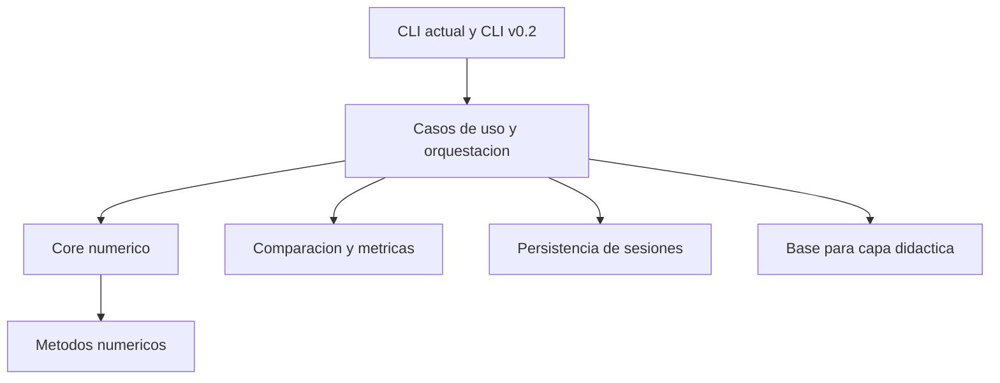
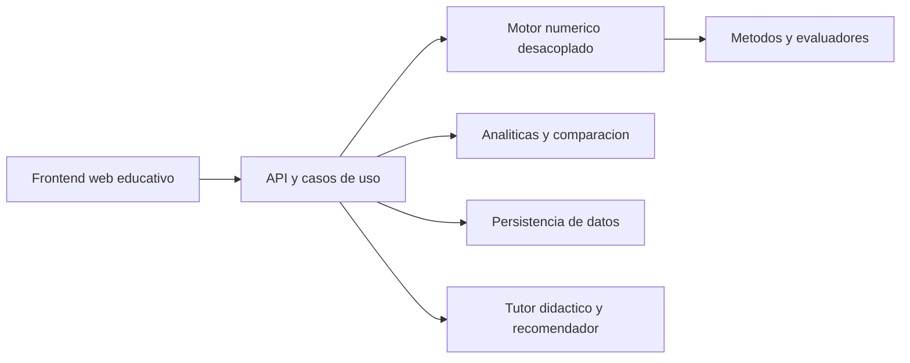
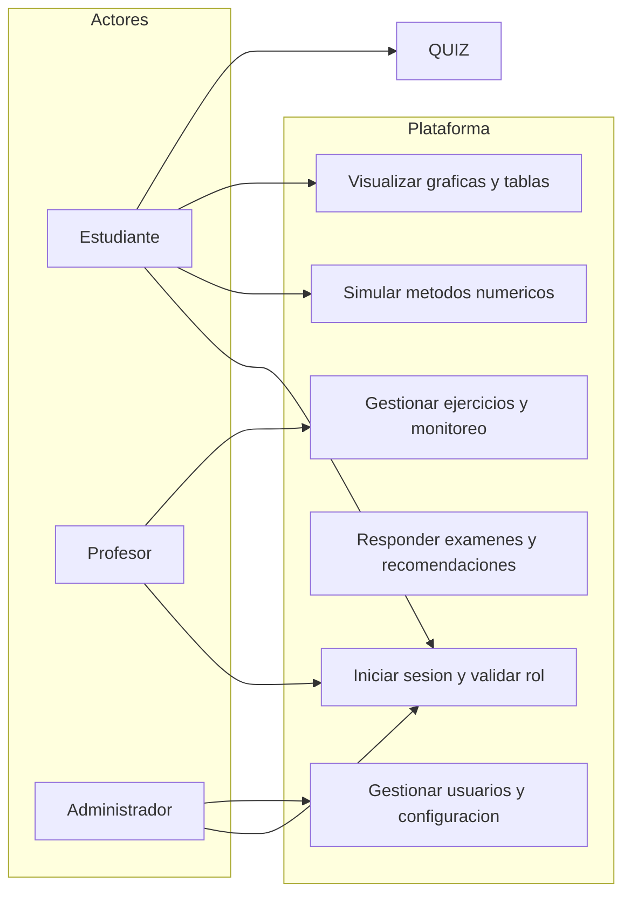
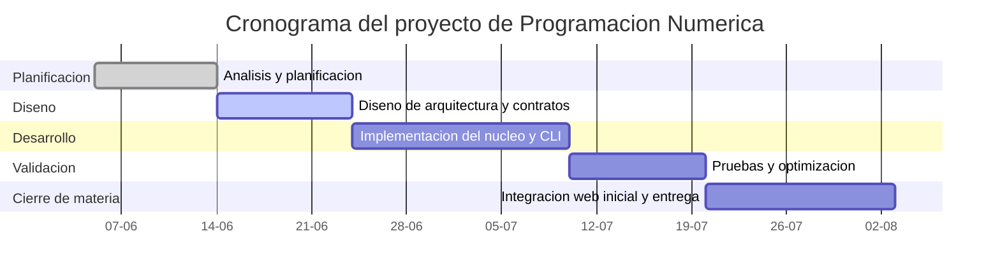
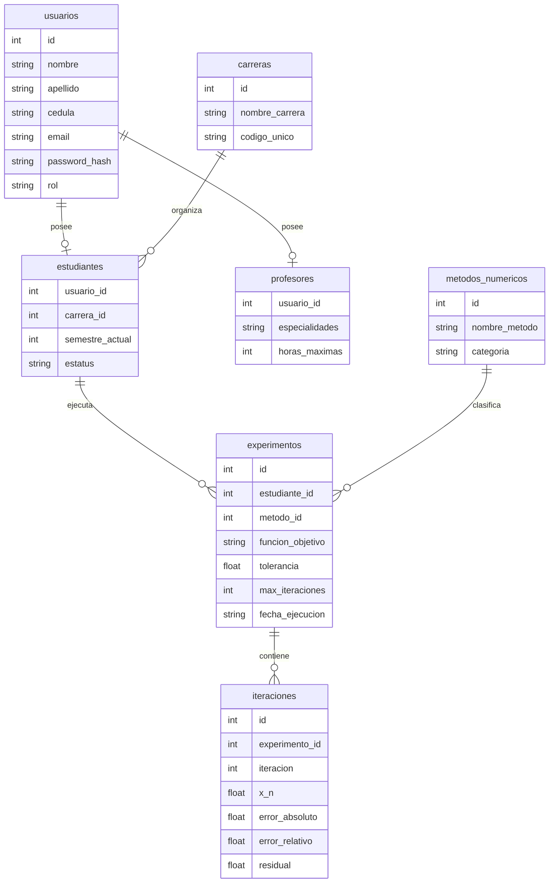

# Instituto Universitario Politecnico "Santiago Marino"

# Desarrollo de una plataforma web interactiva para el aprendizaje de metodos numericos

Proyecto de la materia Programacion Numerica orientado a evolucionar desde una aplicacion de consola en Python hacia una plataforma web educativa, interactiva y trazable para estudiantes y docentes del Instituto Universitario Politecnico "Santiago Marino".

## Identificacion del proyecto

- Autores: Jose Javier Cuello, C.I. 15.179.918; Leonardo Gonzalez, C.I. 31.223.011
- Carrera: Ingenieria de Sistemas
- Materia: Programacion Numerica
- Profesor asesor: Yancelis Noguera
- Estado actual del proyecto: base funcional en Python con CLI academica y bootstrap arquitectonico v0.2
- Direccion principal: plataforma web educativa con nucleo matematico desacoplado

## Resumen ejecutivo

Este proyecto ya resuelve un problema academico real: permite practicar metodos numericos, observar iteraciones, comparar convergencia, estudiar constantes como `e` y `pi`, evaluar funciones con singularidades y apoyar la comprension matematica mediante graficas, figuras 3D y animaciones.

La hoja de ruta del proyecto no consiste en acumular scripts aislados, sino en consolidar un sistema didactico mas completo. La base actual en Python sirve como motor numerico y laboratorio academico; la evolucion v0.2 propone desacoplar ese motor, estandarizar resultados, registrar experimentos y preparar una futura plataforma web con trazabilidad, reportes, analiticas y apoyo pedagogico.

## Problematica y necesidad academica

La enseñanza tradicional de metodos numericos suele apoyarse en calculos manuales, hojas de calculo o scripts de consola ejecutados de forma aislada. Ese enfoque presenta limitaciones que afectan tanto el aprendizaje como la supervision docente.

## Interrogante Principal

¿Cómo diseñar e implementar la base arquitectónica modular y el núcleo numérico desacoplado (versión v0.2) que sirva como fundamento para la evolución de una herramienta de consola hacia una plataforma web interactiva y educativa de métodos numéricos en el Instituto Universitario Politécnico "Santiago Mariño"?

## Interrogantes Específicas

- ¿Cuáles son los requerimientos pedagógicos, funcionales y arquitectónicos necesarios para lograr el desacoplamiento efectivo del motor matemático original basado en consola?
- ¿Cómo debe estructurarse el diseño de una arquitectura modular que garantice la escalabilidad, persistencia de datos y visualización interactiva en una posterior fase web?
- ¿De qué manera se puede desarrollar y optimizar el núcleo numérico para que soporte de forma segura métodos de raíces, análisis de constantes y futuras extensiones algorítmicas?
- ¿Qué elementos técnicos se requieren para implementar la versión base v0.2 asegurando contratos comunes, comparación de métodos, persistencia de sesiones y una CLI reutilizable?
- ¿Cuáles son las pautas y componentes críticos necesarios para preparar la transición fluida del proyecto hacia una siguiente fase que incorpore interfaz web, analíticas académicas y un tutor didáctico?

## Objetivo general

Diseñar e implementar la infraestructura de software modular (v0.2) mediante el desacoplamiento del motor matemático y la persistencia de datos, con el fin de preparar la transición de la herramienta de consola tradicional hacia una plataforma web interactiva para el aprendizaje de métodos numéricos.

## Objetivos especificos

- Analizar los requerimientos pedagogicos, funcionales y arquitectonicos necesarios para desacoplar el motor matematico original basado en consola.
- Disenar una arquitectura modular que permita evolucionar hacia una plataforma web con persistencia, trazabilidad y visualizacion interactiva.
- Desarrollar el nucleo numerico para soportar metodos de raices, analisis de constantes, evaluacion segura y futuras extensiones.
- Implementar una base v0.2 con contratos comunes, comparacion de metodos, persistencia de sesiones y CLI reutilizable.
- Preparar el proyecto para una siguiente fase con interfaz web, analiticas academicas y tutor didactico.

### Conflictos y desafios identificados

- La salida en texto plano dificulta interpretar convergencia, error relativo y comportamiento oscilatorio de varios algoritmos.
- Las ejecuciones en consola no conservan historico estructurado de experimentos, lo que impide comparar resultados y seguir la evolucion del estudiante.
- Los algoritmos mal parametrizados pueden divergir, entrar en ciclos o enfrentar singularidades sin una capa comun de validacion y control.
- El uso exclusivo de terminal aumenta la barrera de entrada para estudiantes que todavia no dominan herramientas tecnicas.
- El docente invierte tiempo extra corrigiendo iteraciones, validando tablas y reconstruyendo resultados de manera manual.
- El proyecto original tenia alto acoplamiento entre logica matematica e interfaz, lo cual dificultaba reutilizacion, pruebas y escalado.

### Necesidades que el proyecto busca cubrir

- Reducir la friccion de uso para estudiantes y docentes.
- Mejorar la comprension del proceso numerico, no solo del resultado final.
- Estandarizar iteraciones, errores, residual y estados de convergencia.
- Guardar y comparar experimentos para trazabilidad academica.
- Introducir visualizacion 2D, 3D y analisis didactico mas accesible.
- Preparar una evolucion seria hacia una plataforma web institucional.

## Que existe hoy en el repositorio

La base actual ya ofrece valor academico concreto y no debe perderse en la migracion. El proyecto existente cubre:

- Resolucion de ecuaciones no lineales por biseccion, secante, Newton-Raphson y punto fijo.
- Analisis numerico del numero de Euler.
- Analisis numerico del numero pi.
- Evaluacion con evasion de singularidades.
- Graficas 3D con enfoque POO.
- Animaciones trigonometricas.
- Menu CLI principal para laboratorio y demostracion academica.

Ademas, la version v0.2 ya introdujo una base modular en `src/` con:

- Modelos comunes de problema y resultados.
- Metodos desacoplados para biseccion y Newton.
- Comparador de metodos.
- Persistencia de sesiones.
- CLI v0.2 basada en casos de uso.
- Pruebas automatizadas para contratos y CLI.

## Vision del proyecto

La vision principal es convertir esta base de Programacion Numerica en una plataforma de aprendizaje y analisis numerico con tres caracteristicas centrales:

1. Un nucleo matematico desacoplado y reutilizable.
2. Una capa de analisis, persistencia y comparacion de experimentos.
3. Una futura interfaz web educativa con enfoque visual, pedagogico e institucional.

Esta direccion es coherente con el valor actual del proyecto, con el alcance del proyecto de la materia y con las necesidades reales de estudiantes y profesores.

## Alcance del sistema

### Alcance actual

- Laboratorio academico de metodos numericos en Python.
- Ejecucion local por consola.
- Visualizacion matematica con graficas y animaciones.
- Primeros contratos comunes y estructura modular v0.2.

### Alcance objetivo de v0.2

- Nucleo numerico desacoplado.
- Comparacion reproducible de metodos.
- Persistencia de sesiones, experimentos e iteraciones.
- Exportacion de resultados y reportes.
- Base para tutor didactico y recomendaciones.
- Preparacion de una interfaz web por roles.

### Fuera del alcance inmediato

- Sustituir bibliotecas cientificas industriales como SciPy o MATLAB.
- Competir en rendimiento de computo masivo.
- Integrarse todavia con bases de datos institucionales reales.
- Desplegar produccion definitiva sin antes validar contratos, seguridad y trazabilidad.

## Metodologia de trabajo

La estrategia del proyecto combina una planificacion secuencial clara con una evolucion modular e incremental. El enfoque practico es:

- consolidar primero el nucleo matematico,
- despues unificar resultados, comparacion y persistencia,
- luego preparar la capa didactica y de reportes,
- y finalmente llevar esa base a una interfaz web educativa.

Ese orden evita construir una interfaz vistosa sobre una base todavia acoplada o poco testeable.

## Arquitectura del proyecto

### Arquitectura actual del repositorio



### Arquitectura objetivo de evolucion web



### Principios arquitectonicos

- Separacion estricta entre interfaz y calculo.
- Contratos comunes para problemas, iteraciones y resultados.
- Reutilizacion del mismo motor en CLI, reportes y futura web.
- Trazabilidad de experimentos para fines academicos.
- Crecimiento gradual sin perder claridad didactica.

## Estructura real del repositorio

```text
.
|-- run.py
|-- run_v0_2.py
|-- requirements.txt
|-- documentacion/
|-- graficas/
|-- metodos/
|   |-- animaciones_trigonometricas.py
|   |-- biseccion.py
|   |-- euler.py
|   |-- evasion_singularidad.py
|   |-- graficas_3d.py
|   |-- newton_raphson.py
|   |-- pi.py
|   |-- punto_fijo.py
|   |-- secante.py
|   |-- sistemas_no_lineales.py
|   `-- sistemas_no_lineales_basico.py
|-- src/
|   |-- analysis/
|   |-- app/
|   |-- core/
|   |-- infrastructure/
|   |-- interfaces/
|   |-- methods/
|   `-- tutoring/
|-- tests/
```

## Modulos y capacidades principales

### Base historica en consola

- `run.py`: menu principal del laboratorio academico.
- `metodos/biseccion.py`: metodo de biseccion.
- `metodos/secante.py`: metodo de la secante.
- `metodos/newton_raphson.py`: metodo Newton-Raphson.
- `metodos/punto_fijo.py`: metodo de punto fijo.
- `metodos/euler.py`: analisis del numero de Euler.
- `metodos/pi.py`: analisis del numero pi.
- `metodos/evasion_singularidad.py`: evaluacion segura.
- `metodos/graficas_3d.py`: visualizacion 3D con POO.
- `metodos/animaciones_trigonometricas.py`: apoyo visual dinamico.

### Base modular v0.2

- `src/core/`: modelos, resultados y parser.
- `src/methods/`: implementaciones desacopladas por familia.
- `src/analysis/`: comparacion y benchmarking.
- `src/infrastructure/storage/`: persistencia de sesiones.
- `src/interfaces/cli/`: CLI basada en arquitectura modular.
- `tests/`: validaciones de contratos y flujo CLI.

## Estructura de vistas por rol de usuario

La plataforma objetivo se concibe con diferentes vistas segun el actor academico. Esta parte sigue siendo propuesta de desarrollo y no funcionalidad ya terminada.

### 1. Visitante

- Acceso a landing page institucional del proyecto.
- Consulta del alcance, autores y valor academico del sistema.
- Entrada a login y registro.

### 2. Estudiante

- Simulador para ingreso de funciones, parametros y metodos.
- Visualizacion de tablas de iteraciones, errores y convergencia.
- Graficas 2D, representaciones 3D y animaciones.
- Historial de experimentos y comparaciones.
- Tutor didactico con recomendaciones y examenes.

### 3. Profesor

- Gestion de ejercicios sugeridos y parametros academicos.
- Monitoreo del rendimiento del grupo.
- Visualizacion de errores frecuentes y patrones de convergencia.
- Administracion de perfil docente y sesiones de tutoria.

### 4. Administrador

- Gestion de usuarios y roles.
- Configuracion de limites de computo y seguridad.
- Consulta de auditorias, logs y analiticas institucionales.
- Control operativo del sistema.

## Caso de uso general por roles



## Roadmap tecnico v0.2

La version v0.2 no se presenta como ruptura total del proyecto actual, sino como una migracion ordenada.

### Fase 1. Nucleo y contratos comunes

- Modelar `ProblemDefinition`, iteraciones y resultados.
- Definir estados de ejecucion y metadatos comunes.
- Separar calculo de la entrada y salida por consola.

### Fase 2. Adaptacion de metodos existentes

- Migrar gradualmente metodos historicos al nuevo nucleo.
- Reutilizar la base ya validada del proyecto actual.
- Unificar mensajes, errores y reportes de convergencia.

### Fase 3. Comparacion y trazabilidad

- Comparar varios metodos sobre un mismo problema.
- Persistir sesiones, resultados e iteraciones.
- Preparar exportacion de datos y reportes.

### Fase 4. Capa didactica

- Agregar explicaciones de convergencia y advertencias.
- Recomendar el metodo segun el tipo de problema.
- Incorporar examenes y apoyo formativo.

### Fase 5. Interfaz web educativa

- Construir vistas por rol.
- Exponer el motor mediante API.
- Incorporar historiales, dashboards y paneles institucionales.

## Cronograma del proyecto

En el repositorio no habia un diagrama de Gantt ya construido; lo que existia era un cronograma tabular. A partir de la ventana de trabajo definida, se plantea el siguiente Gantt entre el `05-06-2026` y el `02-08-2026`.



| Fase | Enfoque | Inicio | Fin | Duracion |
| --- | --- | --- | --- | --- |
| 1 | Analisis y planificacion | 05-06-2026 | 13-06-2026 | 9 dias |
| 2 | Diseno de arquitectura y contratos | 14-06-2026 | 23-06-2026 | 10 dias |
| 3 | Implementacion del nucleo y CLI modular | 24-06-2026 | 09-07-2026 | 16 dias |
| 4 | Pruebas y optimizacion | 10-07-2026 | 19-07-2026 | 10 dias |
| 5 | Integracion web inicial y cierre de entrega | 20-07-2026 | 02-08-2026 | 14 dias |

Nota: este cronograma usa toda la ventana disponible entre el `05 de junio de 2026` y el `02 de agosto de 2026`, para un total de `59 dias` calendario.

## Equipo y division de responsabilidades

- Jose Javier Cuello: backend, modelado de datos, motor numerico desacoplado, parser seguro y estructura base del sistema.
- Leonardo Gonzalez: frontend, experiencia de usuario, interfaces responsivas y componentes de visualizacion interactiva.

## Personas involucradas

- Autoridades universitarias: validacion institucional, apoyo estrategico e infraestructura.
- Docentes de catedra: definicion de necesidades pedagogicas y validacion didactica.
- Estudiantes de Ingenieria: usuarios principales y fuente de retroalimentacion.
- Personal de TI: compatibilidad de entorno, seguridad y despliegue.

## Tecnologias

### Tecnologias implementadas actualmente

- Python
- SymPy
- NumPy
- SciPy
- Matplotlib
- Mermaid para documentacion visual
- `unittest` para pruebas automatizadas

### Tecnologias objetivo para la plataforma web

- Frontend web responsivo con HTML, CSS y JavaScript.
- Visualizacion interactiva 2D y 3D.
- API para consumo del motor numerico desacoplado.
- Base de datos relacional para usuarios, experimentos e iteraciones.
- Infraestructura local y una opcion futura de despliegue cuando el proyecto avance de etapa.

## Seguridad y criterios de integridad

La evolucion web del sistema debe incorporar seguridad desde la arquitectura, no como ajuste posterior.

- Validacion estricta de expresiones matematicas antes de evaluarlas.
- Control de limites de iteraciones y tiempos de ejecucion para evitar sobrecarga.
- Separacion entre datos del usuario, configuracion y resultados numericos.
- Manejo de roles y permisos segun tipo de usuario.
- Trazabilidad de experimentos, errores y eventos relevantes.
- Uso de variables de entorno para configuraciones sensibles en futuras fases de despliegue.

## Modelo de datos propuesto



## Paradigmas de programacion e ingenieria aplicados

- Programacion estructurada y modular para organizar algoritmos por responsabilidad.
- Programacion orientada a objetos en componentes de visualizacion y arquitectura desacoplada.
- Arquitectura por capas para separar interfaces, casos de uso, metodos y persistencia.
- Programacion orientada a eventos como base natural de la futura interfaz web.
- Persistencia relacional para asegurar consistencia historica de experimentos.

## Metodos y contenidos numericos cubiertos

### Ecuaciones no lineales

- Metodo de biseccion.
- Metodo de la secante.
- Metodo de Newton-Raphson.
- Metodo de punto fijo.

### Analisis de constantes

- Aproximaciones del numero de Euler.
- Aproximaciones del numero pi mediante series.

### Recursos de apoyo al aprendizaje

- Evasion de singularidades.
- Graficas matematicas.
- Figuras 3D.
- Animaciones trigonometricas.

## Instalacion y ejecucion

### Requisitos

- Python 3.10 o superior recomendado.
- Entorno virtual activo.

### Instalacion

```bash
pip install -r requirements.txt
```

### Ejecutar la version actual del laboratorio CLI

```bash
python run.py
```

### Ejecutar la base CLI v0.2

```bash
python run_v0_2.py
```

### Ejecutar pruebas

```bash
python -m unittest discover -s tests
```

## Valor academico del proyecto

Este sistema no solo calcula; ensena. Su valor diferencial esta en hacer visible el proceso numerico, permitir comparaciones reproducibles y preparar una evolucion seria hacia una herramienta institucional de apoyo docente.

En su estado actual ya funciona como laboratorio academico. En su direccion v0.2, se convierte en una base solida para una plataforma educativa con integracion por roles, historico de experimentos, apoyo visual y analiticas aplicadas al aprendizaje.

## Conclusiones

La base actual del proyecto demuestra que existe contenido matematico, utilidad pedagogica y potencial tecnico suficientes para justificar su evolucion. La hoja de ruta presentada en este README organiza ese crecimiento sin romper la identidad original del repositorio.

La prioridad correcta no es reemplazar lo existente, sino consolidarlo: desacoplar el motor, unificar contratos, registrar experimentos, fortalecer pruebas y preparar la futura plataforma web sobre una base numerica estable, reutilizable y clara para la materia.
