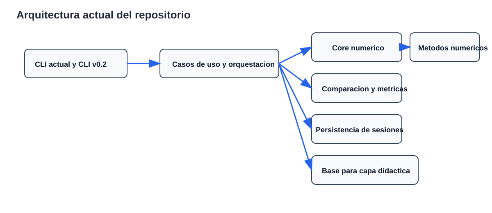
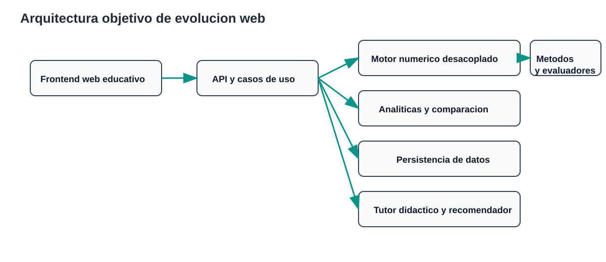
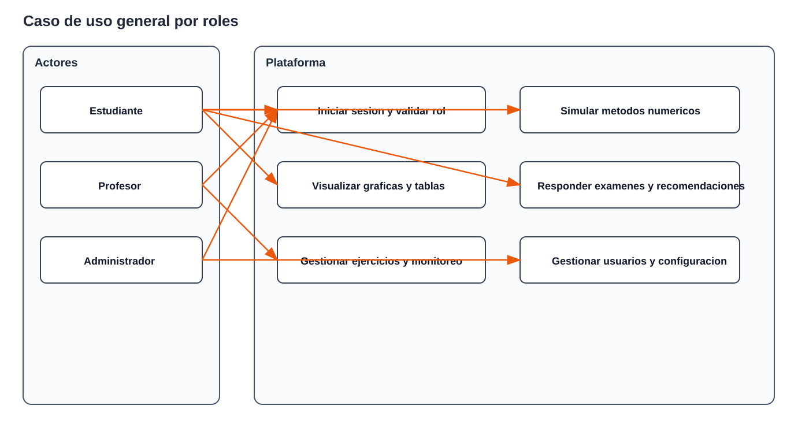
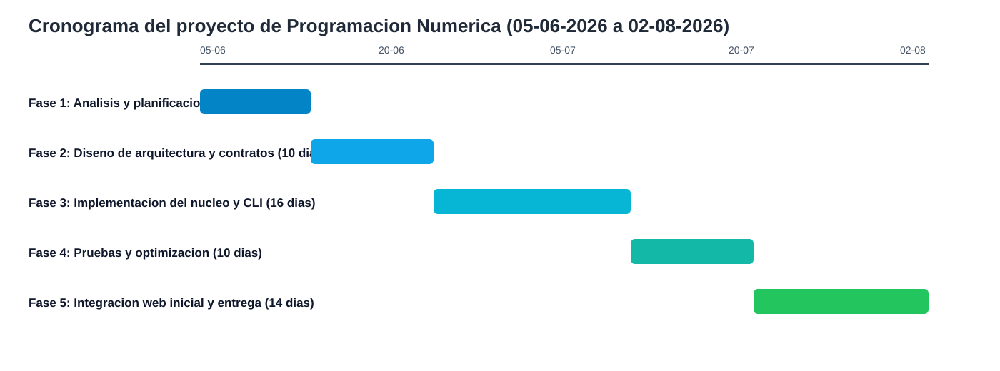
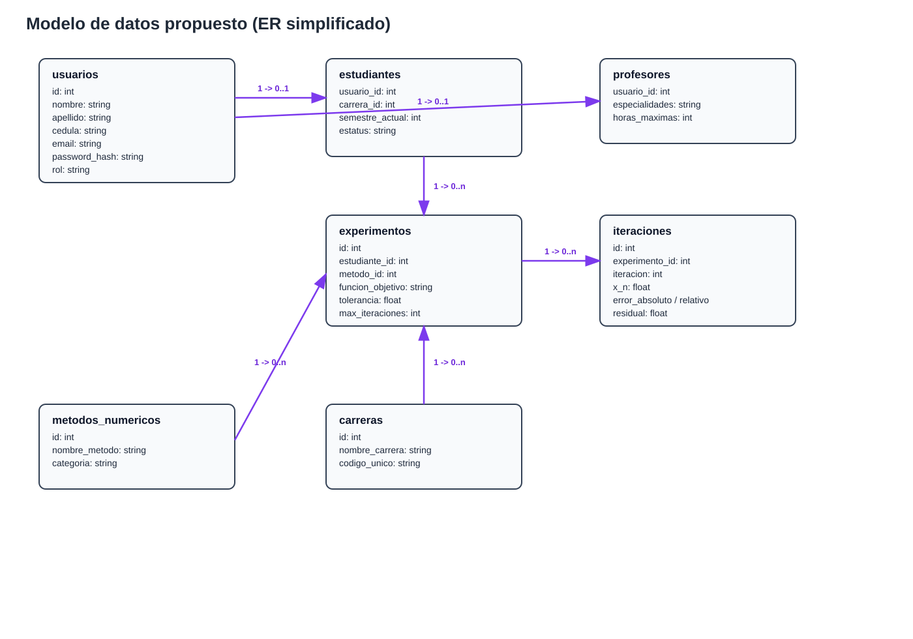
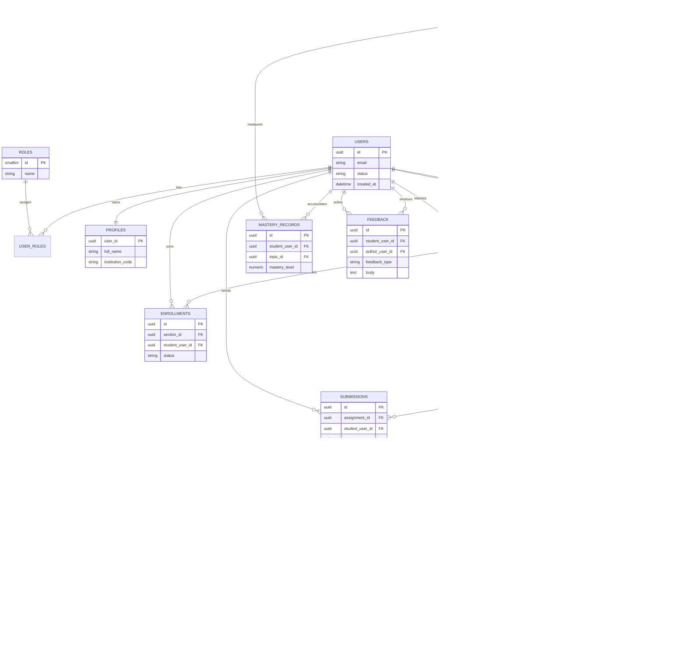
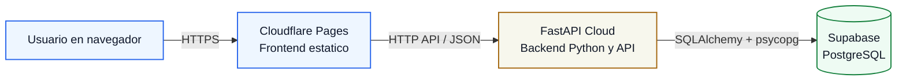

# Instituto Universitario Politecnico "Santiago Marino"

# Desarrollo de una plataforma web interactiva para el aprendizaje de metodos numericos

Proyecto de la materia Programacion Numerica orientado a evolucionar desde una aplicacion de consola en Python hacia una plataforma web educativa, interactiva y trazable para estudiantes y docentes del Instituto Universitario Politecnico "Santiago Marino".

## Identificacion del proyecto

- Autores: Jose Javier Cuello, C.I. 15.179.918; Leonardo Gonzalez, C.I. 31.223.011
- Carrera: Ingenieria de Sistemas
- Materia: Programacion Numerica
- Profesor asesor: Yancelis Noguera
- Estado actual del proyecto: base funcional en Python con CLI academica y bootstrap arquitectonico v0.2
- Direccion principal: plataforma web educativa con nucleo matematico desacoplado

## Resumen ejecutivo

Este proyecto ya resuelve un problema academico real: permite practicar metodos numericos, observar iteraciones, comparar convergencia, estudiar constantes como `e` y `pi`, evaluar funciones con singularidades y apoyar la comprension matematica mediante graficas, figuras 3D y animaciones.

La hoja de ruta del proyecto no consiste en acumular scripts aislados, sino en consolidar un sistema didactico mas completo. La base actual en Python sirve como motor numerico y laboratorio academico; la evolucion v0.2 propone desacoplar ese motor, estandarizar resultados, registrar experimentos y preparar una futura plataforma web con trazabilidad, reportes, analiticas y apoyo pedagogico.

## Problematica y necesidad academica

La enseñanza tradicional de metodos numericos suele apoyarse en calculos manuales, hojas de calculo o scripts de consola ejecutados de forma aislada. Ese enfoque presenta limitaciones que afectan tanto el aprendizaje como la supervision docente.

## Interrogante Principal

¿Cómo diseñar e implementar la base arquitectónica modular y el núcleo numérico desacoplado (versión v0.2) que sirva como fundamento para la evolución de una herramienta de consola hacia una plataforma web interactiva y educativa de métodos numéricos en el Instituto Universitario Politécnico "Santiago Mariño"?

## Interrogantes Específicas

- ¿Cuáles son los requerimientos pedagógicos, funcionales y arquitectónicos necesarios para lograr el desacoplamiento efectivo del motor matemático original basado en consola?
- ¿Cómo debe estructurarse el diseño de una arquitectura modular que garantice la escalabilidad, persistencia de datos y visualización interactiva en una posterior fase web?
- ¿De qué manera se puede desarrollar y optimizar el núcleo numérico para que soporte de forma segura métodos de raíces, análisis de constantes y futuras extensiones algorítmicas?
- ¿Qué elementos técnicos se requieren para implementar la versión base v0.2 asegurando contratos comunes, comparación de métodos, persistencia de sesiones y una CLI reutilizable?
- ¿Cuáles son las pautas y componentes críticos necesarios para preparar la transición fluida del proyecto hacia una siguiente fase que incorpore interfaz web, analíticas académicas y un tutor didáctico?

## Objetivo general

Diseñar e implementar la transición de la herramienta de consola tradicional hacia una plataforma web interactiva para el aprendizaje de métodos numéricos.

## Objetivos especificos

- Analizar los requerimientos pedagogicos, funcionales y arquitectonicos necesarios para desacoplar el motor matematico original basado en consola.
- Disenar una arquitectura modular que permita evolucionar hacia una plataforma web con persistencia, trazabilidad y visualizacion interactiva.
- Desarrollar el nucleo numerico para soportar metodos de raices, analisis de constantes, evaluacion segura y futuras extensiones.
- Implementar una base v0.2 con contratos comunes, comparacion de metodos, persistencia de sesiones y CLI reutilizable.
- Preparar el proyecto para una siguiente fase con interfaz web, analiticas academicas y tutor didactico.

### Conflictos y desafios identificados

- La salida en texto plano dificulta interpretar convergencia, error relativo y comportamiento oscilatorio de varios algoritmos.
- Las ejecuciones en consola no conservan historico estructurado de experimentos, lo que impide comparar resultados y seguir la evolucion del estudiante.
- Los algoritmos mal parametrizados pueden divergir, entrar en ciclos o enfrentar singularidades sin una capa comun de validacion y control.
- El uso exclusivo de terminal aumenta la barrera de entrada para estudiantes que todavia no dominan herramientas tecnicas.
- El docente invierte tiempo extra corrigiendo iteraciones, validando tablas y reconstruyendo resultados de manera manual.
- El proyecto original tenia alto acoplamiento entre logica matematica e interfaz, lo cual dificultaba reutilizacion, pruebas y escalado.

### Necesidades que el proyecto busca cubrir

- Reducir la friccion de uso para estudiantes y docentes.
- Mejorar la comprension del proceso numerico, no solo del resultado final.
- Estandarizar iteraciones, errores, residual y estados de convergencia.
- Guardar y comparar experimentos para trazabilidad academica.
- Introducir visualizacion 2D, 3D y analisis didactico mas accesible.
- Preparar una evolucion seria hacia una plataforma web institucional.

## Que existe hoy en el repositorio

La base actual ya ofrece valor academico concreto y no debe perderse en la migracion. El proyecto existente cubre:

- Resolucion de ecuaciones no lineales por biseccion, secante, Newton-Raphson y punto fijo.
- Analisis numerico del numero de Euler.
- Analisis numerico del numero pi.
- Evaluacion con evasion de singularidades.
- Graficas 3D con enfoque POO.
- Animaciones trigonometricas.
- Menu CLI principal para laboratorio y demostracion academica.

Ademas, la version v0.2 ya introdujo una base modular en `src/` con:

- Modelos comunes de problema y resultados.
- Metodos desacoplados para biseccion y Newton.
- Comparador de metodos.
- Persistencia de sesiones.
- CLI v0.2 basada en casos de uso.
- Pruebas automatizadas para contratos y CLI.

## Vision del proyecto

La vision principal es convertir esta base de Programacion Numerica en una plataforma de aprendizaje y analisis numerico con tres caracteristicas centrales:

1. Un nucleo matematico desacoplado y reutilizable.
2. Una capa de analisis, persistencia y comparacion de experimentos.
3. Una futura interfaz web educativa con enfoque visual, pedagogico e institucional.

Esta direccion es coherente con el valor actual del proyecto, con el alcance del proyecto de la materia y con las necesidades reales de estudiantes y profesores.

## Alcance del sistema

### Alcance actual

- Laboratorio academico de metodos numericos en Python.
- Ejecucion local por consola.
- Visualizacion matematica con graficas y animaciones.
- Primeros contratos comunes y estructura modular v0.2.

### Alcance objetivo de v0.2

- Nucleo numerico desacoplado.
- Comparacion reproducible de metodos.
- Persistencia de sesiones, experimentos e iteraciones.
- Exportacion de resultados y reportes.
- Base para tutor didactico y recomendaciones.
- Preparacion de una interfaz web por roles.

### Fuera del alcance inmediato

- Sustituir bibliotecas cientificas industriales como SciPy o MATLAB.
- Competir en rendimiento de computo masivo.
- Integrarse todavia con bases de datos institucionales reales.
- Desplegar produccion definitiva sin antes validar contratos, seguridad y trazabilidad.

## Metodologia de trabajo

La estrategia del proyecto combina una planificacion secuencial clara con una evolucion modular e incremental. El enfoque practico es:

- consolidar primero el nucleo matematico,
- despues unificar resultados, comparacion y persistencia,
- luego preparar la capa didactica y de reportes,
- y finalmente llevar esa base a una interfaz web educativa.

Ese orden evita construir una interfaz vistosa sobre una base todavia acoplada o poco testeable.

## Arquitectura del proyecto

### Arquitectura actual del repositorio



### Arquitectura objetivo de evolucion web



### Principios arquitectonicos

- Separacion estricta entre interfaz y calculo.
- Contratos comunes para problemas, iteraciones y resultados.
- Reutilizacion del mismo motor en CLI, reportes y futura web.
- Trazabilidad de experimentos para fines academicos.
- Crecimiento gradual sin perder claridad didactica.

## Estructura real del repositorio

```text
.
|-- backend/
|   |-- config/
|   |-- src/              # Motor modular v0.2
|   |   |-- analysis/
|   |   |-- core/
|   |   |-- infrastructure/
|   |   |-- interfaces/
|   |   |-- methods/
|   |   `-- tutoring/
|   |-- tests/            # Pruebas de v0.2
|   |-- run_cli.py        # CLI de v0.2
|   |-- requirements.txt  # Dependencias de Python
|   `-- venv/             # Entorno virtual local
|-- frontend/             # Vistas e interfaz de usuario (Estructura base)
|   |-- assets/
|   |   |-- css/
|   |   |-- img/
|   |   `-- js/
|   |-- pages/
|   |   |-- admin.html
|   |   |-- estudiante.html
|   |   |-- profesor.html
|   |   `-- dashboard.html
|   `-- index.html
|-- legacy/               # Código interactivo v0.1
|   |-- metodos/
|   |-- graficas/
|   `-- run.py
|-- documentacion/        # Diagramas y planeación
|-- .gitignore
`-- README.md
```

## Modulos y capacidades principales

### Base historica en consola (Legacy)

- `legacy/run.py`: menu principal del laboratorio academico.
- `legacy/metodos/biseccion.py`: metodo de biseccion.
- `legacy/metodos/secante.py`: metodo de la secante.
- `legacy/metodos/newton_raphson.py`: metodo Newton-Raphson.
- `legacy/metodos/punto_fijo.py`: metodo de punto fijo.
- `legacy/metodos/euler.py`: analisis del numero de Euler.
- `legacy/metodos/pi.py`: analisis del numero pi.
- `legacy/metodos/evasion_singularidad.py`: evaluacion segura.
- `legacy/metodos/graficas_3d.py`: visualizacion 3D con POO.
- `legacy/metodos/animaciones_trigonometricas.py`: apoyo visual dinamico.

### Base modular v0.2

- `backend/src/core/`: modelos, resultados y parser.
- `backend/src/methods/`: implementaciones desacopladas por familia.
- `backend/src/analysis/`: comparacion y benchmarking.
- `backend/src/infrastructure/storage/`: persistencia de sesiones.
- `backend/src/interfaces/cli/`: CLI basada en arquitectura modular.
- `backend/tests/`: validaciones de contratos y flujo CLI.

## Estructura de vistas por rol de usuario

La plataforma objetivo se concibe con diferentes vistas segun el actor academico. Esta parte sigue siendo propuesta de desarrollo y no funcionalidad ya terminada.

### 1. Visitante

- Acceso a landing page institucional del proyecto.
- Consulta del alcance, autores y valor academico del sistema.
- Entrada a login y registro.

### 2. Estudiante

- Simulador para ingreso de funciones, parametros y metodos.
- Visualizacion de tablas de iteraciones, errores y convergencia.
- Graficas 2D, representaciones 3D y animaciones.
- Historial de experimentos y comparaciones.
- Tutor didactico con recomendaciones y examenes.

### 3. Profesor

- Gestion de ejercicios sugeridos y parametros academicos.
- Monitoreo del rendimiento del grupo.
- Visualizacion de errores frecuentes y patrones de convergencia.
- Administracion de perfil docente y sesiones de tutoria.

### 4. Administrador

- Gestion de usuarios y roles.
- Configuracion de limites de computo y seguridad.
- Consulta de auditorias, logs y analiticas institucionales.
- Control operativo del sistema.

## Caso de uso general por roles



## Roadmap tecnico v0.2

La version v0.2 no se presenta como ruptura total del proyecto actual, sino como una migracion ordenada.

### Fase 1. Nucleo y contratos comunes

- Modelar `ProblemDefinition`, iteraciones y resultados.
- Definir estados de ejecucion y metadatos comunes.
- Separar calculo de la entrada y salida por consola.

### Fase 2. Adaptacion de metodos existentes

- Migrar gradualmente metodos historicos al nuevo nucleo.
- Reutilizar la base ya validada del proyecto actual.
- Unificar mensajes, errores y reportes de convergencia.

### Fase 3. Comparacion y trazabilidad

- Comparar varios metodos sobre un mismo problema.
- Persistir sesiones, resultados e iteraciones.
- Preparar exportacion de datos y reportes.

### Fase 4. Capa didactica

- Agregar explicaciones de convergencia y advertencias.
- Recomendar el metodo segun el tipo de problema.
- Incorporar examenes y apoyo formativo.

### Fase 5. Interfaz web educativa

- Construir vistas por rol.
- Exponer el motor mediante API.
- Incorporar historiales, dashboards y paneles institucionales.

## Cronograma del proyecto

En el repositorio no habia un diagrama de Gantt ya construido; lo que existia era un cronograma tabular. A partir de la ventana de trabajo definida, se plantea el siguiente Gantt entre el `05-06-2026` y el `02-08-2026`.



| Fase | Enfoque | Inicio | Fin | Duracion |
| --- | --- | --- | --- | --- |
| 1 | Analisis y planificacion | 05-06-2026 | 13-06-2026 | 9 dias |
| 2 | Diseno de arquitectura y contratos | 14-06-2026 | 23-06-2026 | 10 dias |
| 3 | Implementacion del nucleo y CLI modular | 24-06-2026 | 09-07-2026 | 16 dias |
| 4 | Pruebas y optimizacion | 10-07-2026 | 19-07-2026 | 10 dias |
| 5 | Integracion web inicial y cierre de entrega | 20-07-2026 | 02-08-2026 | 14 dias |

Nota: este cronograma usa toda la ventana disponible entre el `05 de junio de 2026` y el `02 de agosto de 2026`, para un total de `59 dias` calendario.

## Equipo y division de responsabilidades

- Jose Javier Cuello: backend, modelado de datos, motor numerico desacoplado, parser seguro y estructura base del sistema.
- Leonardo Gonzalez: frontend, experiencia de usuario, interfaces responsivas y componentes de visualizacion interactiva.

## Personas involucradas

- Autoridades universitarias: validacion institucional, apoyo estrategico e infraestructura.
- Docentes de catedra: definicion de necesidades pedagogicas y validacion didactica.
- Estudiantes de Ingenieria: usuarios principales y fuente de retroalimentacion.
- Personal de TI: compatibilidad de entorno, seguridad y despliegue.

## Tecnologias

### Tecnologias implementadas actualmente

- Python
- SymPy
- NumPy
- SciPy
- Matplotlib
- SQLAlchemy
- Alembic
- Psycopg
- Diagramas estaticos SVG para documentacion visual
- `unittest` para pruebas automatizadas

### Tecnologias objetivo para la plataforma web

- Frontend web responsivo con HTML, CSS y JavaScript.
- Visualizacion interactiva 2D y 3D.
- API para consumo del motor numerico desacoplado.
- Base de datos relacional para usuarios, experimentos e iteraciones.
- Infraestructura local y una opcion futura de despliegue cuando el proyecto avance de etapa.

## Estado actual de persistencia y flujo academico

La evolucion reciente del backend ya no se limita al motor numerico. Actualmente el repositorio cuenta con:

- persistencia JSON para sesiones locales de CLI;
- persistencia relacional MVP con SQLAlchemy y Alembic;
- configuracion por entorno para usar SQLite en desarrollo y PostgreSQL en despliegue;
- autenticacion JWT estandar;
- endpoints iniciales para secciones, matriculas y asignaciones;
- endpoints de lectura de asignaciones por estudiante;
- registro opcional de intentos academicos cuando una resolucion numerica llega asociada a una asignacion;
- adaptador FastAPI como via web recomendada y adaptador `stdlib` mantenido para compatibilidad;
- frontend conectado al backend para login, generacion de codigo de clase, matricula y resolucion registrada.

Referencia de implementacion: `documentacion/03_Diseño/implementacion_persistencia_relacional_v0_2.md`.

Referencia de desarrollo y operacion:

- `documentacion/04_Desarrollo/06_flujos_operativos_y_diagramas_v0_2.md`
- `documentacion/04_Desarrollo/07_despliegue_fastapi_cloud_v0_2.md`

## Seguridad y criterios de integridad

La evolucion web del sistema debe incorporar seguridad desde la arquitectura, no como ajuste posterior.

- Validacion estricta de expresiones matematicas antes de evaluarlas.
- Control de limites de iteraciones y tiempos de ejecucion para evitar sobrecarga.
- Separacion entre datos del usuario, configuracion y resultados numericos.
- Manejo de roles y permisos segun tipo de usuario.
- Trazabilidad de experimentos, errores y eventos relevantes.
- Uso de variables de entorno para configuraciones sensibles en futuras fases de despliegue.

## Modelo de datos propuesto



### Modelo conceptual de seguimiento academico

La siguiente propuesta separa identidad, estructura academica, contenido, asignacion, seguimiento y analitica. La intencion es soportar crecimiento funcional sin mezclar catalogos, asignaciones, intentos y resultados historicos.

Documento ampliado de diseno: `documentacion/03_Diseño/modelo_conceptual_base_datos_v0_2.md`.


```mermaid
erDiagram
	USERS ||--o{ USER_ROLES : has
	ROLES ||--o{ USER_ROLES : assigns
	USERS ||--|| PROFILES : owns
	ACADEMIC_TERMS ||--o{ COURSE_SECTIONS : groups
	COURSES ||--o{ COURSE_SECTIONS : offers
	USERS ||--o{ COURSE_SECTIONS : teaches
	COURSE_SECTIONS ||--o{ ENROLLMENTS : contains
	USERS ||--o{ ENROLLMENTS : joins
	TOPICS ||--o{ LEARNING_UNITS : organizes
	LEARNING_UNITS ||--o{ ACTIVITIES : contains
	ACTIVITIES ||--o{ ACTIVITY_VERSIONS : versions
	ACTIVITY_VERSIONS ||--o{ ASSIGNMENTS : instantiates
	COURSE_SECTIONS ||--o{ ASSIGNMENTS : receives
	USERS ||--o{ ASSIGNMENTS : creates
	ASSIGNMENTS ||--o{ SUBMISSIONS : collects
	USERS ||--o{ SUBMISSIONS : sends
	SUBMISSIONS ||--o{ ATTEMPTS : records
	ATTEMPTS ||--o{ ATTEMPT_EVENTS : emits
	USERS ||--o{ MASTERY_RECORDS : accumulates
	TOPICS ||--o{ MASTERY_RECORDS : measures
	USERS ||--o{ FEEDBACK : receives
	USERS ||--o{ FEEDBACK : writes
	USERS ||--o{ STUDY_PLANS : follows
	COURSE_SECTIONS ||--o{ STUDY_PLANS : scopes

	USERS {
		uuid id PK
		string email
		string status
		datetime created_at
	}
	ROLES {
		smallint id PK
		string name
	}
	PROFILES {
		uuid user_id PK
		string full_name
		string institution_code
	}
	COURSES {
		uuid id PK
		string code
		string name
	}
	COURSE_SECTIONS {
		uuid id PK
		uuid course_id FK
		uuid teacher_user_id FK
		string section_name
	}
	ENROLLMENTS {
		uuid id PK
		uuid section_id FK
		uuid student_user_id FK
		string status
	}
	TOPICS {
		uuid id PK
		string name
		string area
	}
	LEARNING_UNITS {
		uuid id PK
		uuid topic_id FK
		string title
	}
	ACTIVITIES {
		uuid id PK
		uuid learning_unit_id FK
		string activity_type
		string title
	}
	ACTIVITY_VERSIONS {
		uuid id PK
		uuid activity_id FK
		int version_number
		jsonb definition
	}
	ASSIGNMENTS {
		uuid id PK
		uuid activity_version_id FK
		uuid section_id FK
		uuid created_by_user_id FK
		datetime due_at
	}
	SUBMISSIONS {
		uuid id PK
		uuid assignment_id FK
		uuid student_user_id FK
		string status
		numeric score
	}
	ATTEMPTS {
		uuid id PK
		uuid submission_id FK
		string method_name
		string outcome_status
		numeric execution_time_ms
		jsonb input_payload
		jsonb result_payload
	}
	ATTEMPT_EVENTS {
		uuid id PK
		uuid attempt_id FK
		string event_type
		jsonb event_data
		datetime occurred_at
	}
	MASTERY_RECORDS {
		uuid id PK
		uuid student_user_id FK
		uuid topic_id FK
		numeric mastery_level
	}
	FEEDBACK {
		uuid id PK
		uuid student_user_id FK
		uuid author_user_id FK
		string feedback_type
		text body
	}
	STUDY_PLANS {
		uuid id PK
		uuid student_user_id FK
		uuid section_id FK
		string status
		jsonb plan_definition
	}
```

### Decision tecnica preliminar de base de datos

La mejor opcion por defecto para la evolucion web es PostgreSQL. La razon no es moda, sino ajuste tecnico al dominio:

- El sistema tiene relaciones fuertes: usuarios, roles, secciones, asignaciones, entregas, intentos y retroalimentacion.
- Se necesita consistencia historica: una actividad versionada no debe romper resultados antiguos.
- Conviene mezclar estructura relacional con flexibilidad controlada para payloads numericos, eventos e intentos; PostgreSQL resuelve esto bien con `JSONB`.
- Una futura API construida con FastAPI encaja de forma natural con PostgreSQL mediante SQLAlchemy o SQLModel y migraciones con Alembic.
- Es una opcion comun para despliegues pequenos y medianos en Render, Railway, Fly.io, Neon, Supabase, AWS RDS o servidores propios.

Alternativas evaluadas de forma resumida:

- SQLite: util para demos locales, pruebas o modo monousuario, pero limitada para concurrencia, seguimiento multiusuario y operacion docente real.
- MySQL/MariaDB: viable, pero PostgreSQL suele dar un mejor equilibrio para consultas analiticas, tipos avanzados y evolucion del dominio educativo.
- MongoDB: no es la mejor primera opcion porque el problema central no es documental sino relacional y trazable.

Recomendacion practica:

- Desarrollo local y pruebas ligeras: SQLite si se necesita velocidad de arranque.
- Persistencia objetivo para web multiusuario y despliegue con FastAPI: PostgreSQL.

Esquema MVP inicial sugerido: `documentacion/03_Diseño/esquema_postgresql_mvp_v0_2.md`.
DDL base de referencia: `documentacion/03_Diseño/esquema_postgresql_mvp_v0_2.sql`.
Registro de implementacion backend: `documentacion/03_Diseño/implementacion_persistencia_relacional_v0_2.md`.

### Que significa priorizar un MVP de base de datos

Priorizar un MVP de base de datos significa no modelar todo el ecosistema institucional en la primera iteracion. En lugar de construir desde ya reportes avanzados, alertas predictivas, gamificacion y auditoria completa, se modela primero el minimo conjunto que ya genera valor academico real.

Ese MVP deberia cubrir:

- usuarios y roles;
- cursos, secciones y matriculas;
- actividades y sus versiones;
- asignaciones creadas por docentes;
- entregas e intentos de los estudiantes;
- retroalimentacion basica del profesor.

Con ese alcance inicial ya se puede responder a preguntas utiles: quien practico, que se le asigno, cuantas veces lo intento, que metodo uso, si convergio y que observacion recibio. Luego, sobre esa base estable, se agregan `attempt_events`, `mastery_records`, `study_plans`, notificaciones y analitica avanzada sin rehacer el nucleo.

## Paradigmas de programacion e ingenieria aplicados

- Programacion estructurada y modular para organizar algoritmos por responsabilidad.
- Programacion orientada a objetos en componentes de visualizacion y arquitectura desacoplada.
- Arquitectura por capas para separar interfaces, casos de uso, metodos y persistencia.
- Programacion orientada a eventos como base natural de la futura interfaz web.
- Persistencia relacional para asegurar consistencia historica de experimentos.

## Metodos y contenidos numericos cubiertos

### Ecuaciones no lineales

- Metodo de biseccion.
- Metodo de la secante.
- Metodo de Newton-Raphson.
- Metodo de punto fijo.

### Analisis de constantes

- Aproximaciones del numero de Euler.
- Aproximaciones del numero pi mediante series.

### Recursos de apoyo al aprendizaje

- Evasion de singularidades.
- Graficas matematicas.
- Figuras 3D.
- Animaciones trigonometricas.

## Instalacion y ejecucion

### Requisitos

- Python 3.10 o superior recomendado.

### Instalacion y Preparacion

La nueva arquitectura separa la experiencia visual en `frontend/`, el nucleo numerico y la CLI modular en `backend/`, y deja `legacy/` como referencia historica del laboratorio de consola. La instalacion de dependencias Python se realiza desde `backend/`:

```bash
cd backend
python -m venv venv

# Activar entorno virtual
# En Windows (PowerShell):
.\venv\Scripts\Activate.ps1
# En Windows (CMD):
.\venv\Scripts\activate.bat
# En Linux/macOS o Git Bash:
source venv/bin/activate

# Instalar dependencias
pip install -r requirements.txt
```

Nota para despliegue: el proyecto usa el comando `fastapi deploy`, por lo que la dependencia de FastAPI se declara con extras estandar en `backend/requirements.txt`.

### Ejecutar pruebas (Suite modular v0.2)

Las pruebas deben ser ejecutadas desde la carpeta `backend/` utilizando el entorno virtual activo para asegurar la correcta resolución de dependencias locales:

```bash
cd backend
python -m unittest discover -s tests
```

### Ejecutar la interfaz web v0.2

La interfaz visual actual vive en `frontend/` y puede levantarse como sitio estatico local:

```bash
cd frontend
python -m http.server 8080
```

Luego abre en el navegador:

```text
http://localhost:8080/
```

Para que el frontend consuma un backend publicado, puede definirse una URL base global antes de cargar `platform-api.js`:

```html
<script>
	window.NUMERICAL_API_BASE_URL = "https://tu-backend.fastapicloud.dev";
</script>
```

Tambien puedes usar como referencia el archivo `frontend/assets/js/platform-config.example.js` para fijar esa URL en despliegues estaticos.

### Ejecutar la CLI modular v0.2

Se ejecuta desde la carpeta `backend/` utilizando el entorno virtual activo:

```bash
cd backend
# Ejemplo para resolver biseccion
python run_cli.py solve --method bisection --expression "x**3 - x - 2" --interval 1 2
```

### Ejecutar la referencia legacy (v0.1)

La version de consola original se conserva en `legacy/` como respaldo academico e historico, pero ya no representa la forma principal de presentar el proyecto:

```bash
python legacy/run.py
```

## Actualizacion de desarrollo del 19-06-2026

Durante la jornada actual el proyecto quedo consolidado en varios frentes funcionales y operativos:

- se completo el paquete documental `documentacion/04_Desarrollo/` para registrar bitacora, backend, frontend, persistencia, pruebas, diagramas y despliegue;
- se agrego una guia especifica para publicar el backend en FastAPI Cloud;
- se documentaron diagramas Mermaid del flujo profesor-estudiante-backend-base de datos;
- el adaptador FastAPI quedo preparado para despliegues con frontend en dominio separado mediante CORS configurable por entorno;
- se agrego `backend/.env.example` como base de configuracion para despliegue y operacion.

Documentos de referencia creados o ampliados en esta fase:

- `documentacion/04_Desarrollo/README.md`
- `documentacion/04_Desarrollo/06_flujos_operativos_y_diagramas_v0_2.md`
- `documentacion/04_Desarrollo/07_despliegue_fastapi_cloud_v0_2.md`
- `documentacion/04_Desarrollo/08_checklist_primer_despliegue_fastapi_cloud.md`
- `documentacion/04_Desarrollo/09_runbook_operativo_fastapi_cloud.md`
- `backend/.env.example`

Ademas, se agrego un script util de verificacion manual del backend publicado:

- `backend/smoke_test_api.sh`

## Actualizacion de desarrollo del 20-06-2026

Durante esta sesion se completo el primer despliegue publico real del proyecto por capas:

- el backend quedo publicado en FastAPI Cloud;
- la base de datos real quedo operando en Supabase PostgreSQL;
- el frontend quedo publicado en Cloudflare Pages;
- se validaron flujos reales de login, registro y resolucion numerica contra el backend publico;
- se documento la arquitectura publicada y el cierre operativo de la sesion.

Documentos nuevos o ampliados para retomar trabajo futuro:

- `documentacion/04_Desarrollo/10_cierre_sesion_despliegue_publico_2026_06_20.md`
- `documentacion/04_Desarrollo/11_hoja_ruta_proxima_iteracion.md`
- `README.md`

## Despliegue recomendado con FastAPI Cloud

La forma recomendada de publicar este proyecto en su estado actual es separar backend y frontend:

- `backend/` se despliega como aplicacion FastAPI;
- `frontend/` se publica como sitio estatico;
- ambos se conectan por HTTP usando la URL publica del backend.

### Arquitectura publicada actual

La arquitectura operativa ya validada para este proyecto queda distribuida en tres piezas claramente separadas:

- `Supabase` aloja la base de datos PostgreSQL del sistema.
- `FastAPI Cloud` ejecuta el backend Python, expone la API y corre la logica de metodos numericos, autenticacion y flujos academicos.
- `Cloudflare Pages` publica el frontend estatico en HTML, CSS y JavaScript que consumen los usuarios desde el navegador.

Esta separacion permite mantener una responsabilidad tecnica clara por capa: interfaz en el borde, logica de aplicacion en la API y persistencia en PostgreSQL.


```mermaid
flowchart LR
	U[Usuario en navegador]
	F[Cloudflare Pages\nFrontend estatico]
	A[FastAPI Cloud\nBackend Python y API]
	D[(Supabase\nPostgreSQL)]

	U -->|HTTPS| F
	F -->|HTTP API / JSON| A
	A -->|SQLAlchemy + psycopg| D

	classDef edge fill:#eef6ff,stroke:#2563eb,stroke-width:1.5px,color:#0f172a;
	classDef app fill:#f7f7ed,stroke:#a16207,stroke-width:1.5px,color:#111827;
	classDef data fill:#eefbf3,stroke:#15803d,stroke-width:1.5px,color:#111827;

	class U,F edge;
	class A app;
	class D data;
```

En terminos practicos, el navegador nunca accede directamente a Supabase. Toda operacion de registro, login, comparacion de metodos, resolucion numerica o flujo academico pasa primero por la API FastAPI, que centraliza validacion, seguridad, reglas de negocio y acceso a datos.

### Punto de entrada del backend

La aplicacion FastAPI de este proyecto se construye con una fabrica ubicada en:

- `src.interfaces.web.app:create_fastapi_app`

Si la deteccion automatica del servicio no encuentra la app, el comando ASGI de referencia es:

```bash
uvicorn src.interfaces.web.app:create_fastapi_app --factory --host 0.0.0.0 --port 8000
```

### Variables de entorno minimas para produccion

Existe un archivo de referencia en `backend/.env.example` con la configuracion base.

Variables minimas esperadas:

- `APP_ENV=production`
- `WEB_ADAPTER=fastapi`
- `DATABASE_URL=postgresql+psycopg://...`
- `AUTH_TOKEN_SECRET=<secreto-largo-y-unico>`
- `CORS_ALLOW_ORIGINS=https://tu-frontend.example.com`

### Secuencia recomendada de publicacion

1. Instalar dependencias desde `backend/`.
2. Validar localmente `GET /api/health`, login y `POST /api/roots/solve`.
3. Ejecutar migraciones con `alembic upgrade head`.
4. Confirmar que el CLI funciona con `fastapi --help`.
5. Desplegar el backend en FastAPI Cloud desde `backend/` con `fastapi deploy`.
6. Publicar el frontend estatico apuntando a la URL publica del backend.
7. Ajustar `CORS_ALLOW_ORIGINS` con el dominio real del frontend.

### Nota operativa importante

Si el backend responde en navegador pero el frontend no logra autenticarse o resolver metodos, los primeros puntos a revisar son:

- la URL base configurada en `window.NUMERICAL_API_BASE_URL`;
- el valor de `CORS_ALLOW_ORIGINS`;
- la configuracion de `DATABASE_URL` y `AUTH_TOKEN_SECRET`.

## Valor academico del proyecto

Este sistema no solo calcula; ensena. Su valor diferencial esta en hacer visible el proceso numerico, permitir comparaciones reproducibles y preparar una evolucion seria hacia una herramienta institucional de apoyo docente.

En su estado actual ya funciona como laboratorio academico. En su direccion v0.2, se convierte en una base solida para una plataforma educativa con integracion por roles, historico de experimentos, apoyo visual y analiticas aplicadas al aprendizaje.

## Conclusiones

La base actual del proyecto demuestra que existe contenido matematico, utilidad pedagogica y potencial tecnico suficientes para justificar su evolucion. La hoja de ruta presentada en este README organiza ese crecimiento sin romper la identidad original del repositorio.

La prioridad correcta no es reemplazar lo existente, sino consolidarlo: desacoplar el motor, unificar contratos, registrar experimentos, fortalecer pruebas y preparar la futura plataforma web sobre una base numerica estable, reutilizable y clara para la materia.
