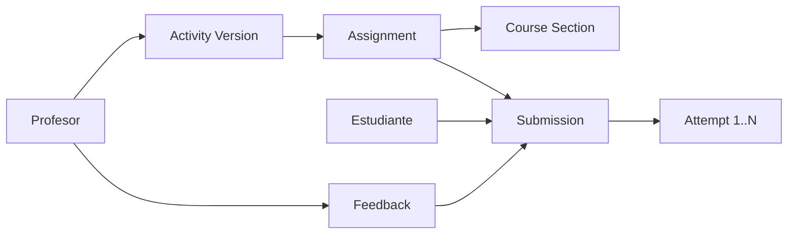

# Esquema PostgreSQL MVP v0.2

## 1. Objetivo

Este documento traduce el modelo conceptual a un primer esquema relacional realista para PostgreSQL. No intenta cubrir toda la vision institucional del producto; su objetivo es definir el minimo conjunto de tablas con el que ya se puede operar el flujo principal:

- el profesor crea o selecciona una actividad;
- la asigna a una seccion;
- el estudiante la resuelve;
- el sistema guarda entregas e intentos;
- el profesor deja retroalimentacion.

## 2. Alcance MVP

Tablas incluidas en el MVP:

- `users`
- `roles`
- `user_roles`
- `profiles`
- `academic_terms`
- `courses`
- `course_sections`
- `enrollments`
- `topics`
- `learning_units`
- `activities`
- `activity_versions`
- `assignments`
- `submissions`
- `attempts`
- `feedback`

Tablas diferidas para la siguiente fase:

- `attempt_events`
- `mastery_records`
- `study_plans`
- `notifications`
- `audit_log`

## 3. Decisiones de diseno

### 3.1. Claves primarias

Se propone `UUID` en tablas de negocio para evitar dependencia de secuencias visibles, facilitar integracion futura con APIs y simplificar sincronizaciones o importaciones.

### 3.2. Estados y catálogos

Los estados iniciales se modelan como `VARCHAR` con `CHECK` cuando el dominio ya es claro. Esto reduce friccion temprana frente a `ENUM` y facilita ajustes durante el MVP.

### 3.3. JSONB en zonas correctas

El esquema evita volver todo flexible. Solo se usa `JSONB` donde tiene sentido:

- `activity_versions.definition`
- `attempts.input_payload`
- `attempts.result_payload`

### 3.4. Separacion de conceptos

- `activities` define la actividad reusable.
- `activity_versions` congela una version.
- `assignments` representa la asignacion docente.
- `submissions` representa la entrega del estudiante.
- `attempts` registra cada ejecucion concreta.

## 4. Flujo de negocio cubierto

## 5. Tablas del MVP

### 5.1. Seguridad e identidad

#### `users`

- Proposito: identidad base del sistema.
- Campos clave: correo, hash de contrasena, estado, marcas de tiempo.

#### `roles`

- Proposito: catalogo de roles.
- Valores iniciales sugeridos: `student`, `teacher`, `admin`.

#### `user_roles`

- Proposito: permitir usuarios con uno o varios roles.

#### `profiles`

- Proposito: datos extendidos de persona, institucion y metadatos basicos.

### 5.2. Estructura academica

#### `academic_terms`

- Proposito: semestres, lapsos o cohortes.

#### `courses`

- Proposito: catalogo de materias.

#### `course_sections`

- Proposito: grupo concreto de un curso impartido por un docente en un periodo.

#### `enrollments`

- Proposito: vincular estudiantes con secciones.

### 5.3. Contenido pedagogico

#### `topics`

- Proposito: areas matematicas de seguimiento.

#### `learning_units`

- Proposito: agrupacion pedagogica de actividades por tema.

#### `activities`

- Proposito: actividad abstracta, reusable y visible para docentes.

#### `activity_versions`

- Proposito: congelar el enunciado, configuracion y criterios usados al momento de asignar.

### 5.4. Operacion academica

#### `assignments`

- Proposito: asignacion de una version de actividad a una seccion.

#### `submissions`

- Proposito: seguimiento por estudiante de una asignacion.
- Nota: una submission agrupa varios intentos del mismo estudiante sobre la misma asignacion.

#### `attempts`

- Proposito: registrar cada corrida o ejecucion.
- Contiene: metodo, payload de entrada, resultado resumido, tiempo y estado.

#### `feedback`

- Proposito: comentarios docentes o del sistema sobre la entrega.

## 6. Campos sugeridos por tabla

### `users`

- `id UUID PK`
- `email VARCHAR(255) UNIQUE NOT NULL`
- `password_hash VARCHAR(255) NOT NULL`
- `status VARCHAR(20) NOT NULL`
- `created_at TIMESTAMPTZ NOT NULL`
- `updated_at TIMESTAMPTZ NOT NULL`

### `roles`

- `id SMALLSERIAL PK`
- `name VARCHAR(50) UNIQUE NOT NULL`
- `description TEXT NULL`

### `user_roles`

- `user_id UUID FK`
- `role_id SMALLINT FK`
- `assigned_at TIMESTAMPTZ NOT NULL`

### `profiles`

- `user_id UUID PK FK`
- `full_name VARCHAR(180) NOT NULL`
- `institutional_code VARCHAR(80) NULL`
- `metadata JSONB NOT NULL DEFAULT '{}'`

### `academic_terms`

- `id UUID PK`
- `name VARCHAR(120) NOT NULL`
- `starts_on DATE NOT NULL`
- `ends_on DATE NOT NULL`
- `status VARCHAR(20) NOT NULL`

### `courses`

- `id UUID PK`
- `code VARCHAR(30) UNIQUE NOT NULL`
- `name VARCHAR(180) NOT NULL`
- `description TEXT NULL`

### `course_sections`

- `id UUID PK`
- `course_id UUID FK`
- `academic_term_id UUID FK`
- `teacher_user_id UUID FK`
- `section_name VARCHAR(80) NOT NULL`
- `status VARCHAR(20) NOT NULL`

### `enrollments`

- `id UUID PK`
- `section_id UUID FK`
- `student_user_id UUID FK`
- `status VARCHAR(20) NOT NULL`
- `enrolled_at TIMESTAMPTZ NOT NULL`

### `topics`

- `id UUID PK`
- `name VARCHAR(120) UNIQUE NOT NULL`
- `area VARCHAR(120) NULL`

### `learning_units`

- `id UUID PK`
- `topic_id UUID FK`
- `title VARCHAR(180) NOT NULL`
- `description TEXT NULL`

### `activities`

- `id UUID PK`
- `learning_unit_id UUID FK`
- `activity_type VARCHAR(40) NOT NULL`
- `title VARCHAR(180) NOT NULL`
- `created_by_user_id UUID FK`
- `is_active BOOLEAN NOT NULL`

### `activity_versions`

- `id UUID PK`
- `activity_id UUID FK`
- `version_number INTEGER NOT NULL`
- `definition JSONB NOT NULL`
- `created_at TIMESTAMPTZ NOT NULL`

### `assignments`

- `id UUID PK`
- `activity_version_id UUID FK`
- `section_id UUID FK`
- `created_by_user_id UUID FK`
- `title VARCHAR(180) NOT NULL`
- `instructions TEXT NULL`
- `opens_at TIMESTAMPTZ NULL`
- `due_at TIMESTAMPTZ NULL`
- `status VARCHAR(20) NOT NULL`

### `submissions`

- `id UUID PK`
- `assignment_id UUID FK`
- `student_user_id UUID FK`
- `status VARCHAR(20) NOT NULL`
- `score NUMERIC(5,2) NULL`
- `submitted_at TIMESTAMPTZ NULL`
- `last_attempt_at TIMESTAMPTZ NULL`

### `attempts`

- `id UUID PK`
- `submission_id UUID FK`
- `attempt_number INTEGER NOT NULL`
- `method_name VARCHAR(50) NOT NULL`
- `outcome_status VARCHAR(40) NOT NULL`
- `execution_time_ms NUMERIC(12,3) NULL`
- `input_payload JSONB NOT NULL`
- `result_payload JSONB NOT NULL`
- `created_at TIMESTAMPTZ NOT NULL`

### `feedback`

- `id UUID PK`
- `submission_id UUID FK`
- `author_user_id UUID FK`
- `feedback_type VARCHAR(40) NOT NULL`
- `body TEXT NOT NULL`
- `created_at TIMESTAMPTZ NOT NULL`

## 7. Restricciones iniciales recomendadas

- `users.email` unico.
- `roles.name` unico.
- `user_roles` con PK compuesta por `user_id, role_id`.
- `enrollments` unico por `section_id, student_user_id`.
- `activity_versions` unico por `activity_id, version_number`.
- `submissions` unico por `assignment_id, student_user_id`.
- `attempts` unico por `submission_id, attempt_number`.

## 8. Indices recomendados para el MVP

- `users(email)`
- `course_sections(teacher_user_id, academic_term_id)`
- `enrollments(student_user_id)`
- `assignments(section_id, due_at)`
- `submissions(student_user_id, status)`
- `attempts(submission_id, created_at desc)`
- `attempts(method_name, outcome_status)`
- `activity_versions using gin(definition)` solo si se consulta ese JSONB con frecuencia.

## 9. Compatibilidad con FastAPI

Este esquema es buena base para una futura implementacion con:

- FastAPI como capa HTTP;
- SQLAlchemy 2.x o SQLModel para mapeo;
- Alembic para migraciones;
- Pydantic para contratos de entrada y salida.

La recomendacion prudente es no introducir ORM hasta definir primero el esquema MVP y los casos de uso prioritarios. Modelar antes de validar el dominio suele llevar a entidades infladas o repositorios mal cortados.

## 10. Siguiente paso tecnico sugerido

El siguiente paso natural ya no es conceptual, sino operativo:

1. convertir este esquema a modelos SQLAlchemy o SQLModel;
2. preparar una primera migracion Alembic;
3. implementar solo los repositorios de `users`, `assignments`, `submissions` y `attempts`.