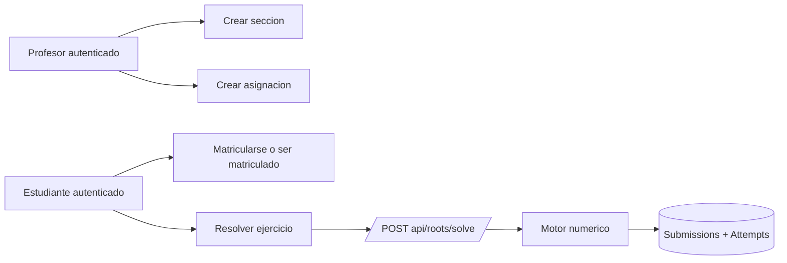

# Implementacion de Persistencia Relacional v0.2

## 1. Objetivo

Este documento registra la implementacion inicial de la capa relacional del backend para que futuras iteraciones, agentes o modelos puedan continuar sobre una base clara.

La meta de esta fase no fue reemplazar la persistencia JSON existente, sino agregar una segunda via de persistencia preparada para evolucion web con FastAPI y PostgreSQL.

## 2. Estado implementado

Se agrego una capa relacional paralela a la persistencia actual:

- configuracion de base y fabrica de sesiones SQLAlchemy;
- modelos ORM del MVP academico;
- repositorios iniciales para usuarios, asignaciones, entregas e intentos;
- configuracion Alembic;
- migracion inicial del esquema relacional;
- pruebas de humo sobre migracion y CRUD basico.

## 3. Archivos agregados o extendidos

### Infraestructura SQL

- `backend/src/infrastructure/storage/db.py`
- `backend/src/infrastructure/storage/sql_models.py`
- `backend/src/infrastructure/storage/sql_repositories.py`
- `backend/src/infrastructure/storage/__init__.py`

### Migraciones

- `backend/alembic.ini`
- `backend/alembic/env.py`
- `backend/alembic/script.py.mako`
- `backend/alembic/versions/20260619_0001_initial_relational_schema.py`

### Pruebas

- `backend/tests/test_v0_2_relational_storage.py`

### Documentacion

- `documentacion/03_Diseño/esquema_postgresql_mvp_v0_2.md`
- `documentacion/03_Diseño/esquema_postgresql_mvp_v0_2.sql`
- este documento

## 4. Decision de convivencia

La persistencia JSON no se elimino. Sigue siendo util para:

- sesiones locales de CLI;
- exportes simples;
- trazas de laboratorio sin dependencia de base de datos.

La nueva persistencia relacional queda preparada para:

- seguimiento multiusuario;
- asignaciones por docente;
- entregas e intentos por estudiante;
- futura integracion con autenticacion y dashboards.

## 5. Dependencias nuevas

Se agregaron al backend:

- `sqlalchemy`
- `alembic`
- `psycopg[binary]`

Estas dependencias conviven con `fastapi` y `uvicorn`, ya presentes en el repositorio.

## 6. Prueba ejecutada

Se valido la nueva capa con:

```bash
cd backend
python -m unittest tests/test_v0_2_relational_storage.py
```

Cobertura de esa prueba:

- aplica migracion Alembic sobre SQLite para validar la forma del esquema;
- crea entidades base del flujo academico;
- persiste asignacion, entrega e intento mediante repositorios SQLAlchemy;
- vuelve a consultar lo guardado para verificar integridad minima.

## 7. Limites actuales

La implementacion no conecta todavia la API HTTP ni los casos de uso existentes con la base relacional. Eso fue deliberado para no mezclar en una misma fase:

- modelado del dominio de datos;
- integracion de persistencia;
- cambios funcionales en endpoints o servicios.

## 8. Siguiente paso recomendado

El siguiente corte razonable es integrar esta capa con casos de uso reales sin romper el flujo actual:

1. agregar una abstraccion de repositorio de intentos y entregas en `app/services` o `app/use_cases`;
2. registrar intentos desde la API web cuando el estudiante ejecute una actividad asignada;
3. incorporar configuracion por entorno para usar SQLite en desarrollo y PostgreSQL en despliegue;
4. despues recien conectar autenticacion, matriculas y vistas por rol.

## 9. Avance posterior implementado

Despues de la primera base relacional, se completo un corte funcional adicional en backend:

- integracion opcional de persistencia relacional desde los casos de uso de resolucion;
- configuracion por entorno para cambiar entre SQLite y PostgreSQL;
- autenticacion basica por token firmado;
- flujo academico inicial de secciones, matriculas y asignaciones;
- registro automatico de intentos cuando una resolucion llega con `assignment_id` y usuario autenticado.

## 10. Variables de entorno activas

- `APP_ENV`: controla el modo general. En `development`, `dev`, `local` o `test` se favorece SQLite por defecto.
- `DATABASE_URL`: URL explicita de base de datos. Si no existe y el entorno es local, se usa SQLite en `backend/data/dev.sqlite3`.
- `DATABASE_ECHO`: activa trazas SQLAlchemy si vale `true`.
- `AUTO_CREATE_SCHEMA`: si vale `true`, crea esquema automaticamente al arrancar el servidor.
- `AUTH_TOKEN_SECRET`: secreto para firmar tokens de autenticacion.
- `APP_HOST`: host del servidor HTTP.
- `APP_PORT`: puerto del servidor HTTP.

## 11. Endpoints agregados en esta fase

### Autenticacion

- `POST /api/auth/register`
- `POST /api/auth/login`

### Flujo academico inicial

- `POST /api/academic/sections`
- `POST /api/academic/enrollments`
- `POST /api/academic/assignments`

### Registro de intentos

- `POST /api/roots/solve`

Cuando el payload incluye `assignment_id` y la peticion trae `Authorization: Bearer <token>`, el backend intenta crear o reutilizar una `submission` y guarda un `attempt` asociado.

## 12. Flujo integrado actual



## 13. Validacion ejecutada

La regresion ampliada validada al cierre fue:

```bash
cd backend
python -m unittest tests/test_v0_2_contracts.py tests/test_v0_2_cli_and_storage.py tests/test_v0_2_web_api.py tests/test_v0_2_relational_storage.py tests/test_v0_2_web_academic_flow.py
```

Resultado: `Ran 19 tests ... OK`.

## 14. Avance posterior de integracion completa

En un corte posterior se completo la union entre backend academico y frontend web:

- la autenticacion basica se migro a JWT estandar con `PyJWT`;
- `run_web.py` ahora puede levantar el adaptador `FastAPI` por defecto o el adaptador `stdlib` segun `WEB_ADAPTER`;
- se agregaron endpoints de lectura para asignaciones del estudiante;
- el frontend deja de depender de credenciales mock y usa login real contra backend;
- el profesor genera un codigo de clase respaldado por una `section` y una `assignment` reales;
- el estudiante carga ese codigo, se matricula y resuelve una asignacion real con registro automatico de `attempts`.

## 15. Endpoints de lectura agregados

- `GET /api/academic/my-assignments`
- `GET /api/academic/assignments/{assignment_id}`

## 16. Variables y adaptadores web

- `WEB_ADAPTER=fastapi`: adaptador recomendado y valor por defecto actual.
- `WEB_ADAPTER=stdlib`: mantiene disponible el servidor basado en `http.server`.

## 17. Frontend conectado al backend

Archivos clave del frontend conectados a la capa academica:

- `frontend/assets/js/platform-api.js`
- `frontend/pages/login.html`
- `frontend/assets/js/auth-ui.js`
- `frontend/assets/js/profesor.js`
- `frontend/assets/js/estudiante.js`

## 18. Regresion validada al cierre actual

```bash
cd backend
python -m unittest tests/test_v0_2_contracts.py tests/test_v0_2_cli_and_storage.py tests/test_v0_2_web_api.py tests/test_v0_2_relational_storage.py tests/test_v0_2_web_academic_flow.py tests/test_v0_2_fastapi_api.py
```

Resultado: `Ran 20 tests ... OK`.

Advertencia residual conocida:

- `fastapi.testclient` emite un aviso deprecado por compatibilidad con la version actual de `httpx` en el entorno. No rompe funcionalidad, pero conviene revisarlo en una fase de afinado de dependencias.