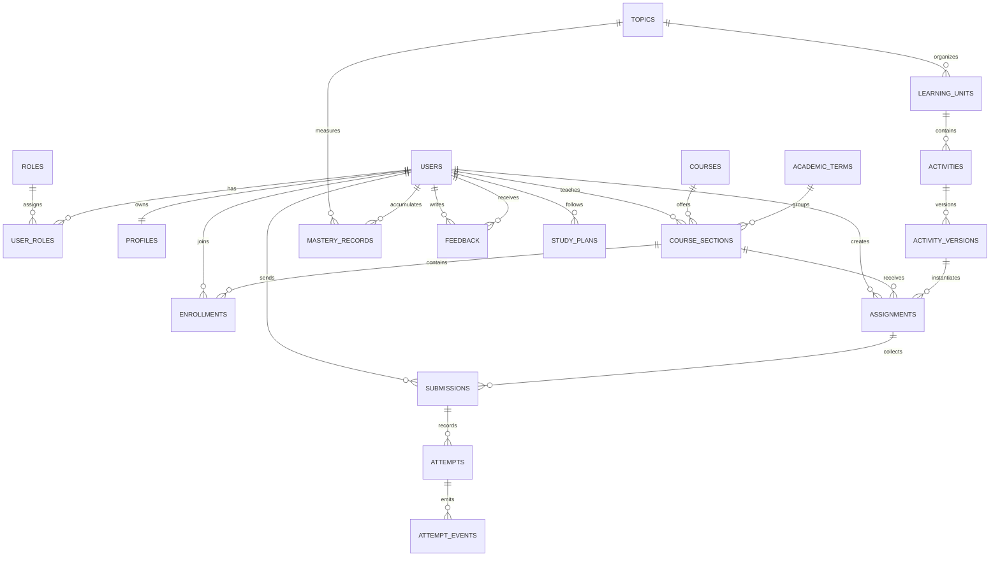

# Modelo Conceptual de Base de Datos y Decision Tecnica (v0.2)

## 1. Objetivo del modelo

La base de datos no debe limitarse a guardar usuarios y resultados numericos. Debe servir como soporte para seguimiento de estudiantes, gestion docente, trazabilidad de intentos, versionado de actividades y crecimiento futuro hacia analiticas y recomendaciones.

La regla principal del diseno es separar claramente:

- identidad y acceso;
- estructura academica;
- contenido pedagogico;
- asignaciones;
- intentos y resultados;
- analitica y evolucion futura.

## 2. Entidades principales

### 2.1. Identidad y acceso

- `users`: credenciales, estado y fecha de alta.
- `roles`: catalogo de roles del sistema.
- `user_roles`: relacion muchos a muchos entre usuario y rol.
- `profiles`: informacion personal y academica extendida.

### 2.2. Estructura academica

- `academic_terms`: periodos academicos.
- `courses`: cursos o materias.
- `course_sections`: secciones o grupos concretos dictados por un docente.
- `enrollments`: matriculas de estudiantes por seccion.

### 2.3. Contenido y aprendizaje

- `topics`: areas como raices, singularidades, constantes o integracion.
- `learning_units`: agrupacion pedagogica de actividades.
- `activities`: actividad abstracta reutilizable.
- `activity_versions`: version concreta de una actividad para conservar historico.

### 2.4. Seguimiento operativo

- `assignments`: actividad asignada por un profesor a una seccion.
- `submissions`: entrega o estado de resolucion por estudiante.
- `attempts`: ejecucion concreta de un intento con parametros, metodo y resultado.
- `feedback`: observaciones del profesor o del sistema.

### 2.5. Escalabilidad futura

- `attempt_events`: eventos finos de interaccion durante un intento.
- `mastery_records`: nivel de dominio por estudiante y tema.
- `study_plans`: rutas personalizadas de refuerzo.
- `notifications`: avisos del sistema.
- `audit_log`: trazabilidad operativa y seguridad.

## 3. Diagrama entidad-relacion conceptual

## 4. Principios de modelado

### 4.1. Separar catalogo de ejecucion

Una `activity` define que se quiere practicar. Una `assignment` define a quien se le asigna y en que contexto. Un `attempt` define que hizo realmente el estudiante.

Si se mezclan estas tres cosas en una sola tabla, se pierde trazabilidad y despues cuesta comparar cohortes o reconstruir historicos.

### 4.2. Versionar actividades

Una actividad puede cambiar de enunciado, parametros o criterios. Por eso `activity_versions` debe congelar la definicion usada cuando se creo una asignacion. Asi se conserva consistencia historica.

### 4.3. Guardar estado final y evidencia del proceso

No basta con la nota o la raiz final. Para este dominio conviene guardar:

- metodo numerico usado;
- expresion o problema;
- tolerancia y limites;
- estado de convergencia;
- tiempo de ejecucion;
- resumen o detalle del intento.

### 4.4. Usar estructura relacional con flexibilidad controlada

No todos los datos del dominio merecen columnas fijas. Los payloads de intentos, configuraciones de actividades y eventos detallados pueden vivir en `JSONB` mientras las relaciones academicas clave siguen siendo relacionales.

## 5. Evaluacion de PostgreSQL

## 5.1. Pregunta central

Si el proyecto va a evolucionar hacia una API publicada con FastAPI, ¿PostgreSQL sigue siendo la mejor opcion?

La respuesta pragmatica es si, como base principal objetivo.

## 5.2. Por que PostgreSQL encaja bien

- El dominio es relacional por naturaleza: usuarios, cursos, secciones, asignaciones, entregas y feedback.
- Se necesita integridad referencial para no perder consistencia academica.
- Se requieren campos flexibles para intentos y eventos; `JSONB` ayuda sin perder SQL.
- Escala bien desde proyecto pequeno hasta uso institucional moderado.
- Tiene muy buena compatibilidad con FastAPI, SQLAlchemy, SQLModel y Alembic.
- Es portable a casi cualquier proveedor de despliegue serio.

## 5.3. Comparacion breve con otras opciones

### SQLite

Puntos a favor:

- muy simple para prototipos;
- cero administracion;
- buena para pruebas locales.

Limites para este proyecto:

- peor concurrencia para multiples usuarios;
- menos adecuada para operacion docente y trazabilidad multiusuario real;
- crecimiento mas incomodo cuando aparecen reportes, bloqueos y carga simultanea.

### MySQL o MariaDB

Puntos a favor:

- maduras y conocidas;
- funcionan bien para aplicaciones CRUD clasicas.

Limites relativos frente a PostgreSQL:

- menor comodidad para evolucionar hacia consultas mas ricas y payloads semiestructurados;
- en este tipo de sistema, PostgreSQL suele dar un mejor balance entre rigor relacional y flexibilidad.

### MongoDB

Puntos a favor:

- flexible para documentos y cambios rapidos.

Limites para este dominio:

- el problema principal no es documental sino academico-relacional;
- modelar relaciones historicas, matriculas y trazabilidad termina siendo mas costoso.

## 5.4. Decision recomendada

- Base objetivo de produccion y despliegue web: PostgreSQL.
- Opcion local de desarrollo temprano o demos aisladas: SQLite.
- La API puede migrar a FastAPI sin conflicto con esta decision; de hecho, PostgreSQL es una combinacion muy comun con FastAPI.

## 6. Explicacion del paso 3: priorizar un MVP de base de datos

Cuando se habla de priorizar un MVP de base de datos no se propone recortar calidad, sino recortar alcance inicial para llegar antes a una base util y valida.

En terminos practicos, significa construir primero lo minimo necesario para soportar el flujo academico central:

- el profesor crea o selecciona una actividad;
- la asigna a una seccion;
- el estudiante la resuelve;
- el sistema guarda intentos y resultado;
- el profesor revisa seguimiento basico y deja feedback.

Eso se puede implementar con el siguiente subconjunto:

- `users`
- `roles`
- `profiles`
- `courses`
- `course_sections`
- `enrollments`
- `activities`
- `activity_versions`
- `assignments`
- `submissions`
- `attempts`
- `feedback`

Con ese primer bloque ya se puede operar y aprender del producto real. Despues se agregan las capas de valor incremental:

### Fase posterior A: seguimiento enriquecido

- `attempt_events`
- `mastery_records`
- `study_plans`

### Fase posterior B: operacion institucional

- `notifications`
- `audit_log`
- cache de reportes

### Fase posterior C: inteligencia pedagogica

- recomendaciones automaticas;
- alertas tempranas;
- evaluacion adaptativa.

La ventaja de este enfoque es simple: primero se valida el flujo real con datos reales. Despues se expande con menos riesgo y sin rehacer el modelo base.

## 7. Siguiente aterrizaje tecnico

Para evitar que el modelo conceptual quede demasiado abstracto, este diseno se aterriza en dos piezas complementarias:

- esquema MVP documentado: `documentacion/03_Diseño/esquema_postgresql_mvp_v0_2.md`;
- DDL inicial para PostgreSQL: `documentacion/03_Diseño/esquema_postgresql_mvp_v0_2.sql`.