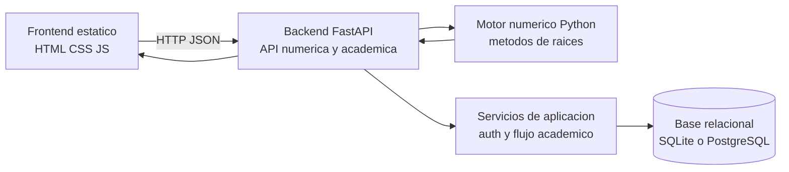
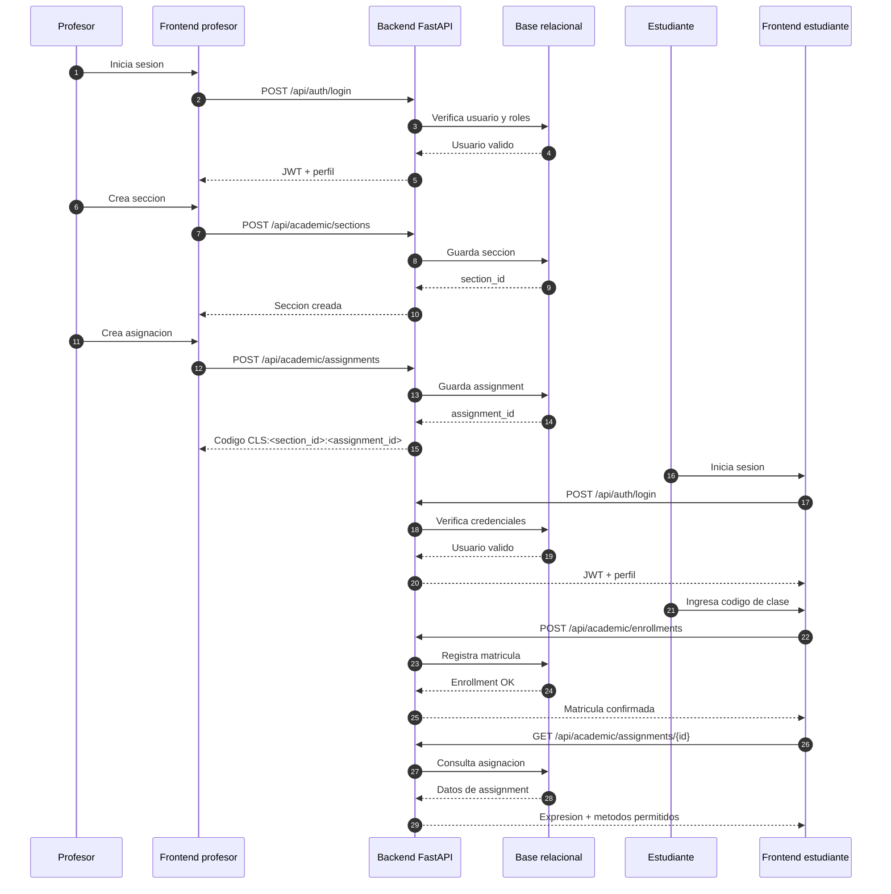
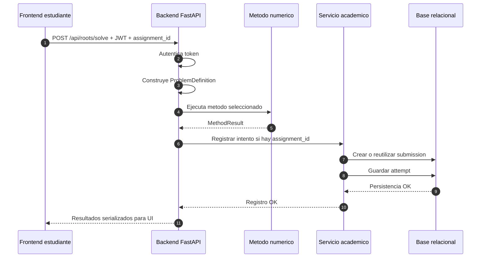
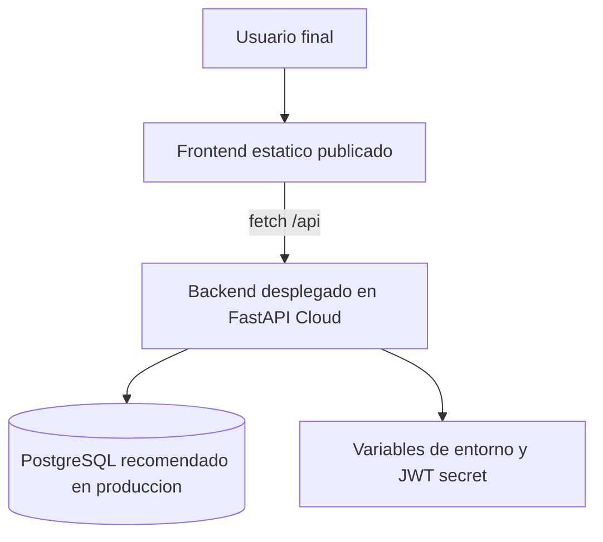

# Flujos Operativos y Diagramas v0.2

## Objetivo de este documento

Traducir el estado actual del sistema a diagramas operativos simples para que cualquier desarrollador, evaluador o futuro modelo pueda entender rapidamente como fluye la aplicacion entre frontend, backend, autenticacion, persistencia y seguimiento academico.

## 1. Topologia web actual

Lectura del diagrama:

- el frontend ya no calcula las raices localmente como camino principal;
- la API FastAPI centraliza autenticacion, asignaciones y resolucion numerica;
- el backend conserva separacion entre motor numerico y servicios academicos;
- la persistencia relacional soporta el seguimiento real de usuarios y actividades.

## 2. Flujo profesor-estudiante sobre una asignacion real

## 3. Flujo de una resolucion numerica con trazabilidad academica

Puntos importantes:

- la resolucion numerica sigue desacoplada del seguimiento academico;
- el registro de intentos es opcional y depende del contexto de asignacion;
- el frontend recibe una forma de datos compatible con sus tablas y graficas.

## 4. Topologia de despliegue recomendada para la fase actual

Interpretacion:

- el frontend y el backend pueden vivir en servicios distintos;
- si se publican en dominios separados, el backend debe permitir CORS para el dominio del frontend;
- en produccion conviene usar PostgreSQL y no SQLite.

## 5. Decision operativa actual

La forma mas coherente de publicar el proyecto hoy es:

1. desplegar el backend Python como aplicacion FastAPI;
2. publicar el frontend estatico en un hosting de archivos web;
3. conectar ambos mediante una URL base de API y CORS configurado por entorno.

Eso respeta la arquitectura ya implementada y evita rehacer el frontend para insertarlo artificialmente dentro del backend en esta etapa.