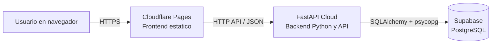

# Cierre de sesion de despliegue publico - 2026-06-20

## Objetivo de este documento

Dejar un cierre operativo claro de la sesion en la que el proyecto paso de pruebas locales integradas a una topologia publica separada entre frontend, backend y base de datos.

## Estado alcanzado al cierre

Al terminar esta sesion, el proyecto ya cuenta con una topologia publicada y verificable:

- `Supabase` aloja la base de datos PostgreSQL real.
- `FastAPI Cloud` ejecuta el backend Python en `https://programacionnumerica.fastapicloud.dev`.
- `Cloudflare Pages` publica el frontend estatico en `https://programacion-numerica-frontend.pages.dev`.

## Logros concretos de la sesion

### 1. Backend publicado y operativo en FastAPI Cloud

Se resolvio el problema inicial de autodescubrimiento del servicio agregando un punto de entrada explicito mediante `backend/main.py`.

Resultados validados:

- la aplicacion arranca correctamente en FastAPI Cloud;
- `GET /api/health` responde en publico;
- `/docs` queda accesible;
- el backend informa `storage_backend: postgresql` cuando usa la configuracion correcta.

### 2. Base de datos real conectada a Supabase

Durante la sesion se confirmo que la forma correcta de conexion para este entorno era el `Session Pooler` de Supabase y no el host directo IPv6-only.

Se validaron estos puntos:

- `DATABASE_URL` compatible con `postgresql+psycopg://...`;
- migraciones aplicadas con `alembic upgrade head`;
- operaciones reales de escritura y lectura contra PostgreSQL.

### 3. Error de autenticacion a base de datos resuelto

El bloqueo mas importante de la sesion fue un `500` en `POST /api/auth/register` ya en entorno publico. La causa real fue una `DATABASE_URL` remota mal cargada en FastAPI Cloud.

Hallazgo clave:

- el pooler de Supabase exigia el usuario `postgres.xueoyajpoekcxsxkxmhm` y no `postgres`.

Despues de corregir la variable remota:

- `POST /api/auth/register` paso a responder `201`;
- `POST /api/auth/login` paso a responder `200`.

### 4. Frontend preparado para backend publico

Se agrego una configuracion centralizada del frontend mediante:

- `frontend/assets/js/platform-api.js`
- `frontend/assets/js/platform-config.example.js`
- `frontend/assets/js/platform-config.js`

Ademas, las paginas que usan la API quedaron cargando `platform-config.js` antes de `platform-api.js`.

### 5. Validacion funcional desde navegador

Se ejecutaron validaciones manuales y automatizadas sobre la interfaz web:

- login docente correcto;
- acceso a `profesor.html`;
- ejecucion de comparacion de algoritmos con resultados reales;
- registro de un estudiante de prueba;
- login estudiantil correcto;
- acceso a `estudiante.html`;
- resolucion de simulacion con tabla de iteraciones y metricas reales.

Estas pruebas se realizaron con frontend servido localmente pero consumiendo el backend ya desplegado en FastAPI Cloud.

### 6. Frontend publicado en Cloudflare Pages

Tambien se publico el frontend en:

- `https://programacion-numerica-frontend.pages.dev`

El despliegue fue exitoso con configuracion estatica simple:

- `Framework preset`: `None`
- `Build command`: vacio
- `Build output directory`: `frontend`

## Pendiente principal al cierre

El frontend publico ya responde, pero todavia no puede consumir la API publica por politica CORS del backend.

Prueba de referencia ejecutada:

```bash
curl -i -X OPTIONS https://programacionnumerica.fastapicloud.dev/api/auth/login \
  -H 'Origin: https://programacion-numerica-frontend.pages.dev' \
  -H 'Access-Control-Request-Method: POST' \
  -H 'Access-Control-Request-Headers: content-type'
```

Resultado observado:

- `HTTP/2 400`
- `Disallowed CORS origin`

Correccion pendiente en FastAPI Cloud:

```text
CORS_ALLOW_ORIGINS=https://programacion-numerica-frontend.pages.dev
```

Si se desea seguir soportando frontend local de pruebas, el valor puede quedar asi:

```text
CORS_ALLOW_ORIGINS=http://127.0.0.1:8080,https://programacion-numerica-frontend.pages.dev
```

## Arquitectura operativa resultante



## Archivos mas relevantes tocados o creados en esta fase

- `backend/main.py`
- `backend/.env.example`
- `backend/smoke_test_api.sh`
- `backend/src/interfaces/web/app.py`
- `frontend/assets/js/platform-api.js`
- `frontend/assets/js/platform-config.example.js`
- `frontend/assets/js/platform-config.js`
- `frontend/index.html`
- `frontend/pages/login.html`
- `frontend/pages/perfil.html`
- `frontend/pages/profesor.html`
- `frontend/pages/estudiante.html`
- `README.md`

## Siguiente accion natural

La siguiente accion tecnica de menor costo y mayor impacto es corregir `CORS_ALLOW_ORIGINS` en FastAPI Cloud, redeployar el backend y validar login real directamente desde `https://programacion-numerica-frontend.pages.dev`.